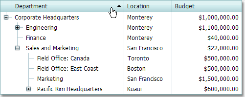

# Sort Nodes
Click a column header to sort data in ascending order. If sorting has already been applied, subsequent clicks reverse the current sort order.
	

A click on a column header clears the sort settings on any other columns. Hold the SHIFT key down while clicking to sort against multiple columns.

Click a column's header while pressing the CTRL key to clear the column's sorting.