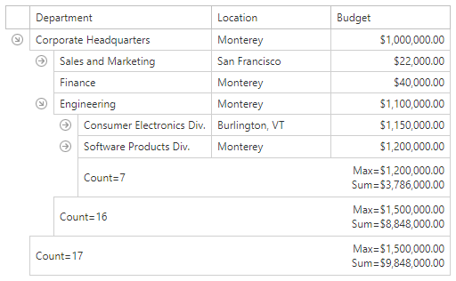

# Data Summaries

 A summary calculates the value of an aggregate function over 
 all the values in a group of nodes and displays the results in the footer.

 The following aggregate functions are available:
* Average
* Count
* Max
* Min
* Sum

   
