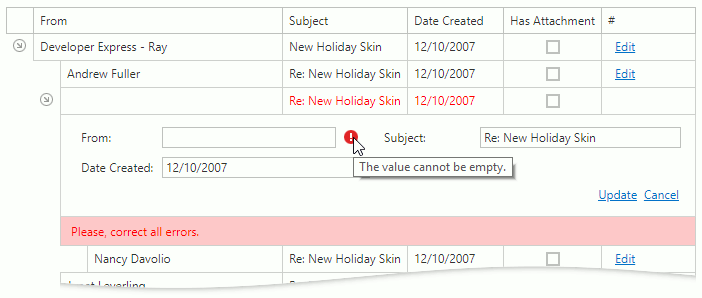

# Data Validation
The Tree List validates entered values and displays errors if a value does not pass validation.

An error icon indicating the invalid value. Hover the mouse over the icon to display a hint with the error's description.

Correct every invalid value to save data. 

