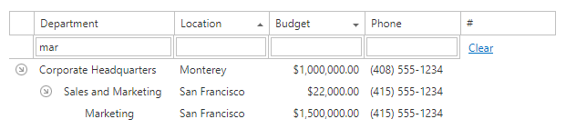
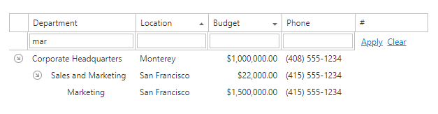

# Filter Row
Type text within the **Filter Row**'s cells to filter the corresponding columns.

To remove a column's filter, clear the text in the column's filter row. 

You can modify a filter row's cell values and click **Apply** or click **Clear** to remove all the applied filters.

