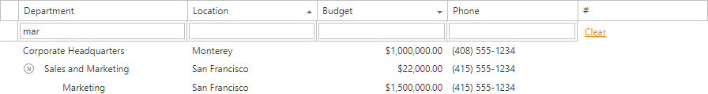
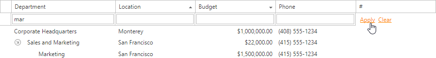
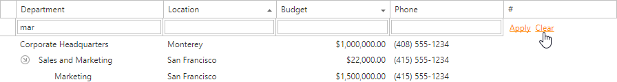

#Filter Row

Typing text within the **Filter Row** automatically creates a filter condition based on the value entered and applies it to the corresponding column.

If the **Apply** button is displayed, click the button to apply the filter.

To remove the column filter, clear the text in the auto-filter row. To remove the grid's entire filter, click **Clear**.

