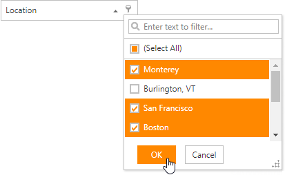
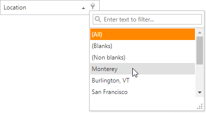

# Header Filter

Use the **Header Filter** to filter tree list data against a column.

Click a filter button to invoke the filter dropdown which lists unique values within a column.

If the dropdown displays checkboxes, select the required values, and click **OK** to apply the filter criteria.

If the dropdown displays its items as a regular list, click the value to apply the filter criteria.

If filtering is applied, the tree list displays only values that match the filter criteria. To remove the filter, click **(All)** in the dropdown.
