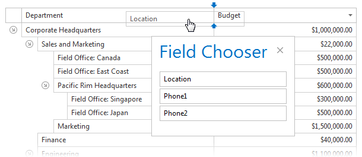

# Column Chooser
Click the **Column Chooser** toolbar button to invoke the Column Chooser panel.

* Drag a column's header onto Column Chooser panel to hide the column.

* Drag a column's header from the Column Chooser panel and drop it onto the column header panel to make the column visible.

> [!NOTE]
> This functionality may be disabled depending on the application vendor's policies.
