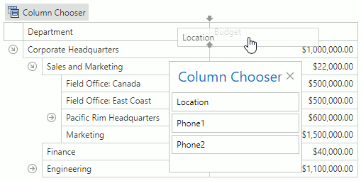

# Field Chooser
The **Field Chooser** allows you to select the fields displayed in a **Tree List**.
* To hide a field from the Tree List, drag it from the Tree List header, and drop it onto the Field Chooser.
* To add a field to the Tree List, drag it from the Field Chooser, and drop it onto the Tree List header.

> This functionality may be disabled in your application depending on the policies of the application vendor.