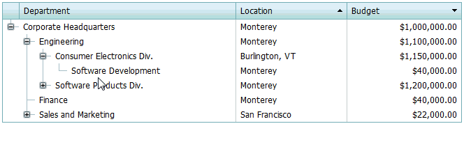

# Reorder Tree List Nodes
To change a node's location, drag it via the mouse, and drop it at the required position.

> [!NOTE]
> This functionality may be disabled in your application. This is the choice of the application vendor.