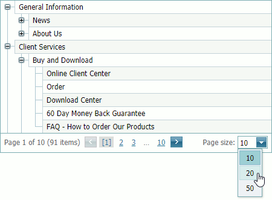

# Selection and Navigation in Tree List
## Navigation
To switch between pages, use the embedded Pager.

&nbsp;

To change the number of data items (rows) displayed within a tree-list, click a page size selector and select the needed number of rows per page.

## Selection
To toggle a node's selected state, preserving the previous selection, use the selection check box, if available.

