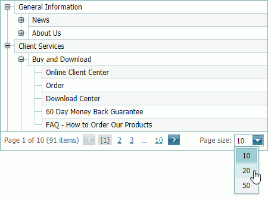
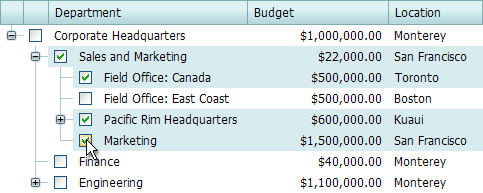
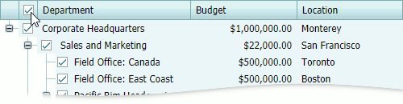
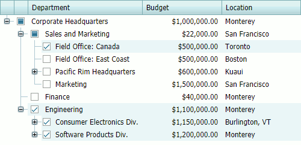

# Selection and Navigation
## Navigation
Use the Tree List's pager to switch between pages.

To change the number of nodes in a Tree List, click the **Page Size** menu and select the number of nodes per page.

## Selection

Select and clear a check box to select and unselect the node. 

Select and clear the **Select All** checkbox to select and unselect all nodes. 

## Recursive Selection

When you check a node in recursive selection mode, it automatically checks all its immediate child nodes, and vice versa.

