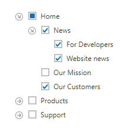

# Tree View Nodes Checking
Click on a check box to toggle the node's checked state.

**Recursive Checking**

In the recursive checking mode you can check nodes recursively, i.e. checking a node automatically checks all its immediate child nodes, and vice versa.

