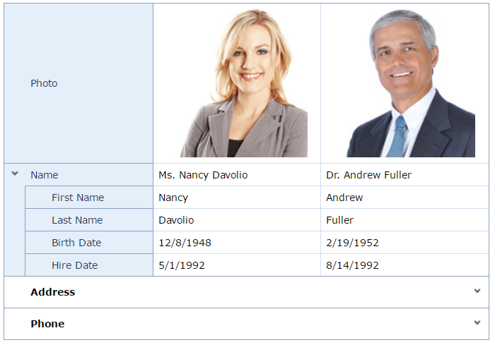

# Vertical Grid
The Vertical Grid displays data records as grid columns, and data fields as grid rows. Vertical grid features include data editing, sorting, and filtering support.

**Data Editing**
* [Add, Delete and Recover Columns](vertical-grid/data-editing/add-delete-and-recover-columns.md)
* [Switch to Edit Mode](vertical-grid/data-editing/switch-to-edit-mode.md)
* [Save or Discard Changes](vertical-grid/data-editing/save-or-discard-changes.md)

**Selection and Navigation**
* [Page Navigation](vertical-grid/selection-and-navigation/page-navigation.md)
* [Select Records](vertical-grid/selection-and-navigation/select-records.md)

**Sorting**
* [Sorting](vertical-grid/sorting.md)

**Filtering**
* [Header Filter](vertical-grid/filtering/header-filter.md)
* [Search Panel](vertical-grid/filtering/search-panel.md)
* [Creating Complex Filter Criteria with the Filter Builder](vertical-grid/filtering/creating-complex-filter-criteria-with-the-filter-control.md)

**Expand and Collapse Category Rows**
* [Expand and Collapse Category Rows](vertical-grid/expand-and-collapse-category-rows.md)

**Data Summaries**
* [Data Summaries](vertical-grid/data-summaries.md)

**Data Validation**
* [Data Validation](vertical-grid/data-validation.md)

**Data Export**
* [Data Export](vertical-grid/data-export.md)