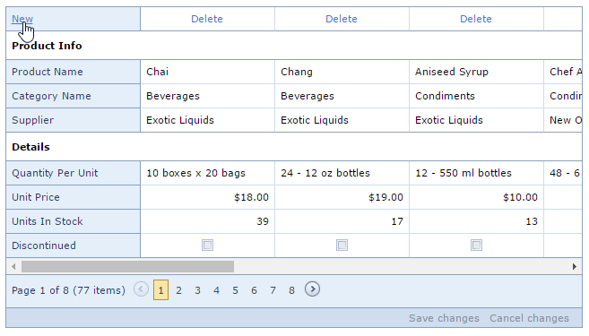
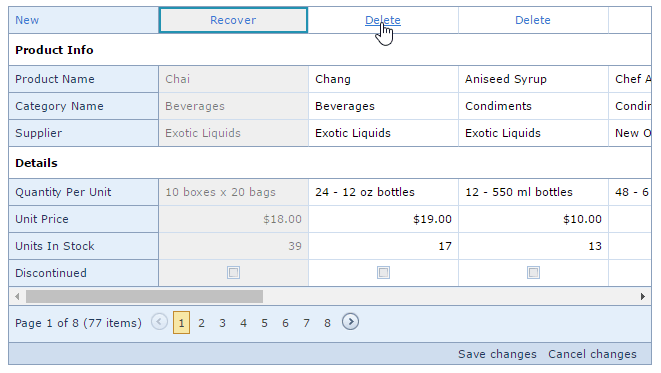
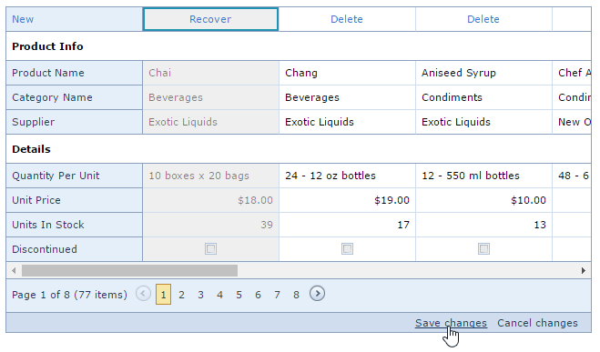
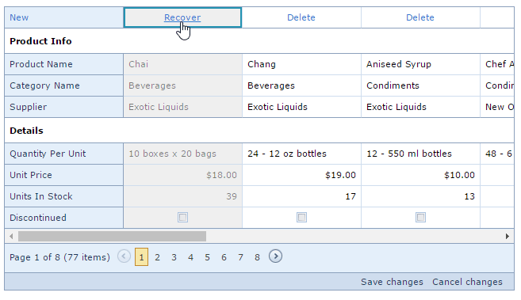

# Add, Delete and Recover Columns
## Add a Column
To create a new column:
* Click **New**.
	
	
* Specify cell values.
* Click **Save changes**.
	
	

## Delete a Column
* To delete a column, click **Delete** within the column to be deleted.
	
	
* Click **Save changes**.
	
	

## Recover Deleted Column
* To recover a deleted column before saving changes, click **Recover** within the column to be recovered.
	
	
* Click **Save changes**.
