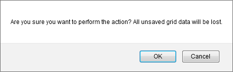

The **Vertical Grid** allows you to edit a group of records (on a single page) and save these changes with one click. In this view, you can create new records, delete existing records and edit individual cell values.
* To create a new record, click the **New** button and specify the field values.
* To delete a record, click the **Delete** button in the record to be deleted.
* To recover a deleted record, click the **Recover** button in the record to be recovered.
* To edit a cell value, click (or double-click) the cell and edit the value.

To navigate through grid cells during batch editing, use **TAB** and **SHIFT+TAB** to move focus forward and backward.

The cells that were modified are highlighted in a different color. To save all changes, click the **Save changes** button. To cancel all changes, click the **Cancel changes** button.

If the **Vertical Grid** contains unsaved data, a confirmation message is displayed before the data is lost (e.g., when sorting data, changing the page or closing a web page). You can choose whether to proceed and lose changes or cancel the action.

