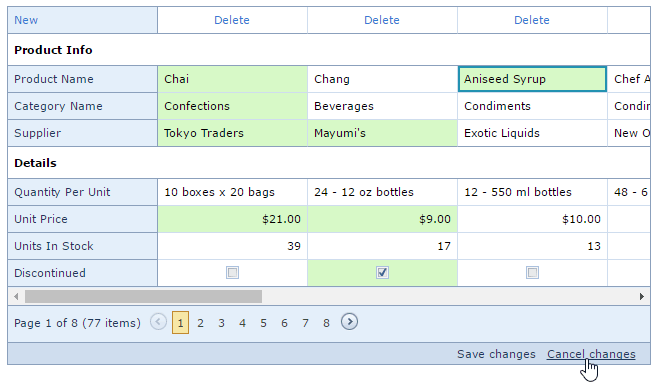

# Save or Discard Changes when Editing Grid Records
## Save Changes
To save the changes you made, click **Save changes**.

## Discard Changes
To cancel the changes you made, click **Cancel changes**.

