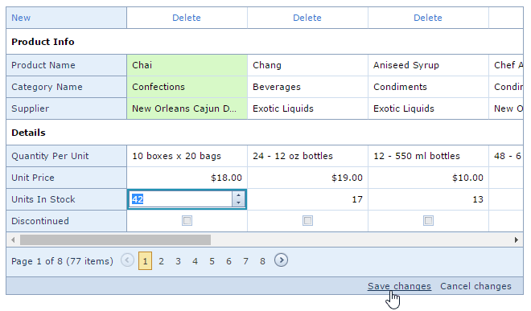

# Save or Discard Changes
The vertical grid allows you to edit a group of cells (on a single page) and save these changes with one click.

You can modify cell values and click **Save changes** or click **Cancel changes**  to discard all the changes.

If a vertical grid contains unsaved data, a confirmation message is displayed before the data is lost (e.g., when sorting the data, changing the page or closing the web page). You can choose whether to proceed and lose changes or cancel the action.

