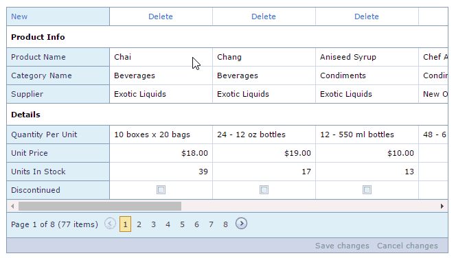
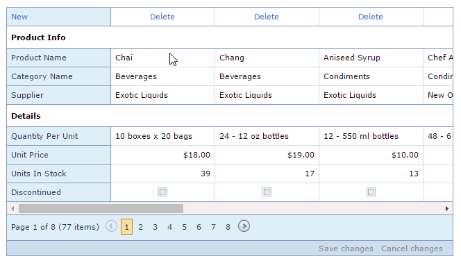
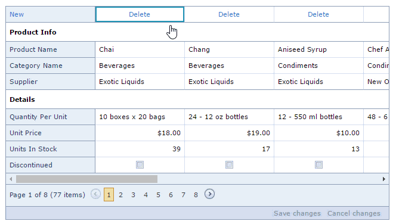

# Switch to Edit Mode
To switch to edit mode do one of the following.

* Click a cell.
	
	
* Double click a cell.
	
	
* Click a focused cell.
	
	

> [!NOTE]
> Editing mode may be unavailable in your application, as this is a decision made by the application vendor.