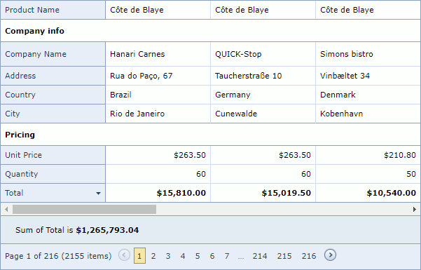

# Data Summaries

A summary calculates the value of an aggregate function over all the columns and is displayed in the summary panel.
 The following aggregate functions are available:
* Average
* Count
* Max
* Min
* Sum

   

 

