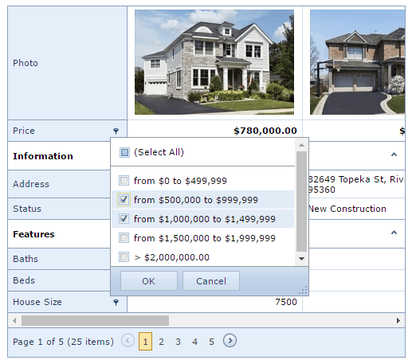
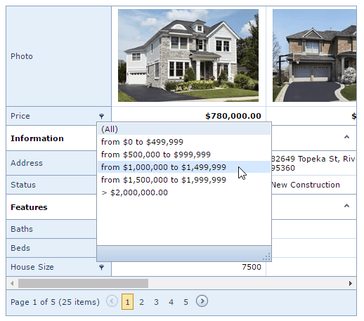

# Header Filter
You can use the **Header Filter** to filter data or change the filter conditions in the vertical grid.

Click a filter button to invoke a filter drop-down list that contains unique values in a row.

You can use the check boxes in the drop-down list to select values and click **OK** to apply the filter criteria.

If the drop-down list does not display check boxes, click the required value to apply the filter criteria.

The drop-down list displays values that match the applied filter criteria. To remove the filter, click **(All)**.