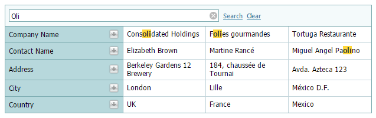
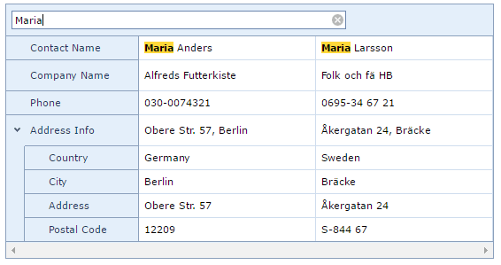
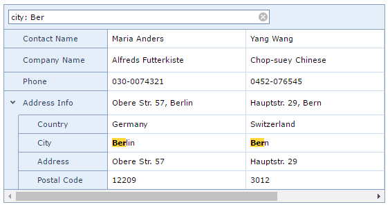
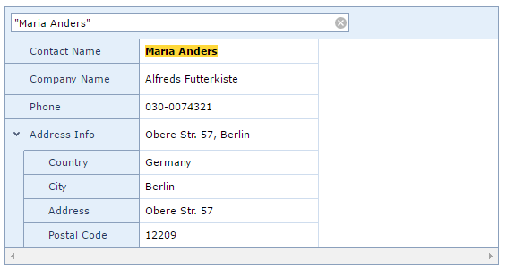
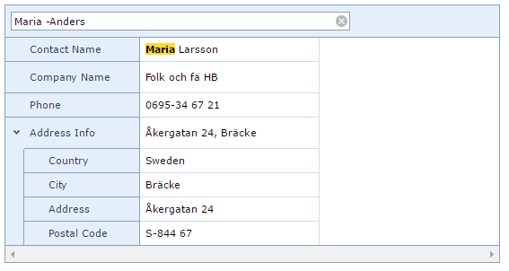
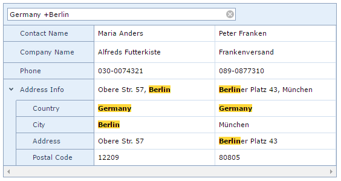

# Search Panel
Type a filter criterion in the search panel to filter data and highlight search results.

## Apply the Search Panel Filter Criterion
To apply a filter criterion typed in the search panel, press the ENTER key or click **Search**. Otherwise, a filter is automatically applied in 1.2 seconds.

## Clear the Search Panel Filter Criterion
To clear the search panel filter criterion, do one of the following.
* Press the DELETE or BACKSPACE key.
* Click the **Clear** button.
* Click the clear button, which is displayed within the editor when the editor is focused and is not empty.
	
	

## Search syntax
In its simplest form, a search criterion consists of a single word. However, the search panel allows you to create composite criteria.
* **Mask:** criterion 
	
	**Example:** Maria
	
	
	
	**Example description:** selects records that contain the "Maria" string in any search row.
* **Mask:** row:criterion 
	
	**Example:** city: ber
	
	
	
	You can search against a specific row by preceding a search string with the row's caption and a colon character. Instead of the complete caption, it is possible to use the initial characters of the caption. A search will be performed against the first row whose name starts with the specified substring. If you want to search against a row whose caption contains space characters, specify the row's display caption in quotation marks.
	
	If the search string contains multiple conditions separated by space characters, and at least one condition defines a search against a specific row, only records that match all of these conditions are shown (i.e., the conditions are combined by the AND logical operator).
	
	**Example description:** selects records that contain "ber" in the row that starts with "city".
* **Mask:** criterion1 criterion2 
	
	**Example:** France Ma
	
	
	
	The search panel allows to search words separated by space characters using the AND logical operator (i.e., the conditions are combined by the AND logical operator). Only records that match all of the conditions are shown.
	
	**Example description:** selects records that contain both "France" AND "Ma" strings in any search row.
* **Mask:** "criterion with spaces" 
	
	**Example:** "Maria Anders"
	
	
	
	If you want to search for a string containing a space character, specify this string in quotation marks.
	
	**Example description:** selects records that contain "maria anders" in any search row.
* **Mask:** criterion1 -criterion2
	
	**Example:** maria -anders
	
	
	
	Precede a condition with "-" to exclude records that match this condition from the resulting set. There should be no space between the "-" sign and the condition.
	
	**Example description:** selects records that contain "maria", excluding records that contain "anders".
* **Mask:** criterion1 +criterion2
	
	**Example:** Germany +berlin
	
	
	
	Precede a condition with "+" to display only records that match this condition. The "+" specifier allows you to implement the logical AND operator. There should be no space character between the "+" sign and the condition.
	
	**Example description:** selects records that contain "Germany", excluding records that contain "berlin".