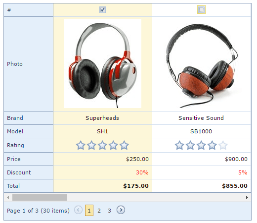
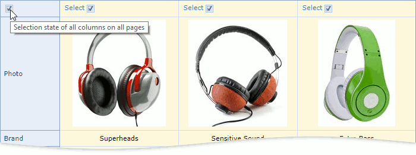

# Select Records
You can select columns as follows:
* Click **Select** to toggle the corresponding column's selected state. 
* Select and clear a check box to select and cancel the selection of the corresponding column.

Select and clear the **Select All** check box to select and cancel the selection of all columns on the page (or all columns in the grid). 
