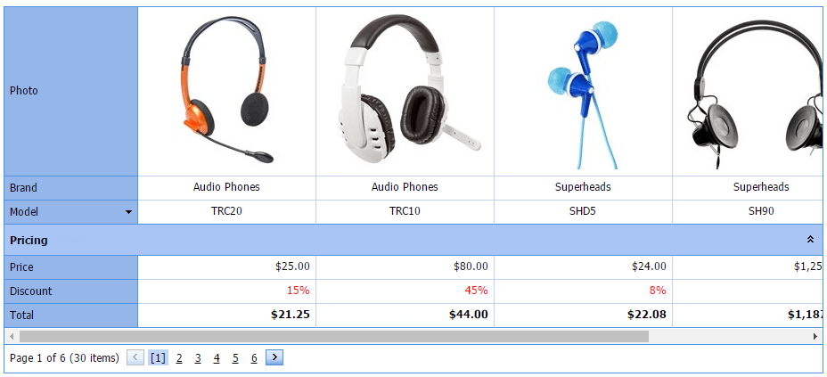

# Sorting
Click a row header to sort data in ascending order. If sorting has already been applied, subsequent clicks reverse the current sort order.
	

A click on a row header clears the sort settings on any other rows. Hold the SHIFT key down while clicking to sort against multiple rows.

Click a row's header while pressing the CTRL key to clear the row's sorting.