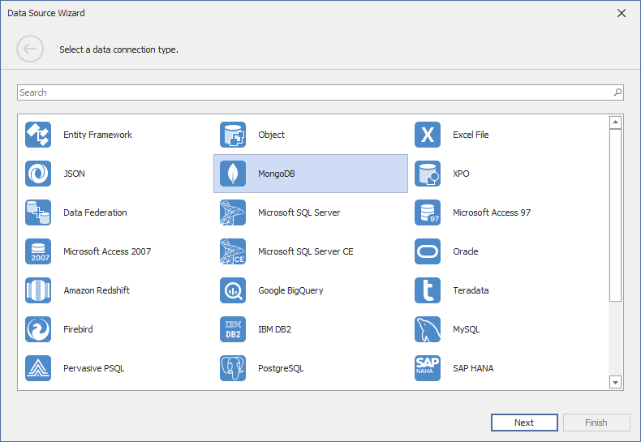
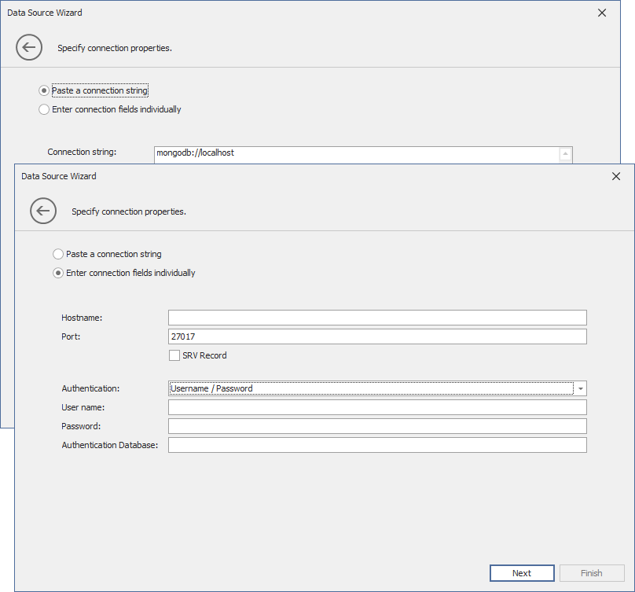
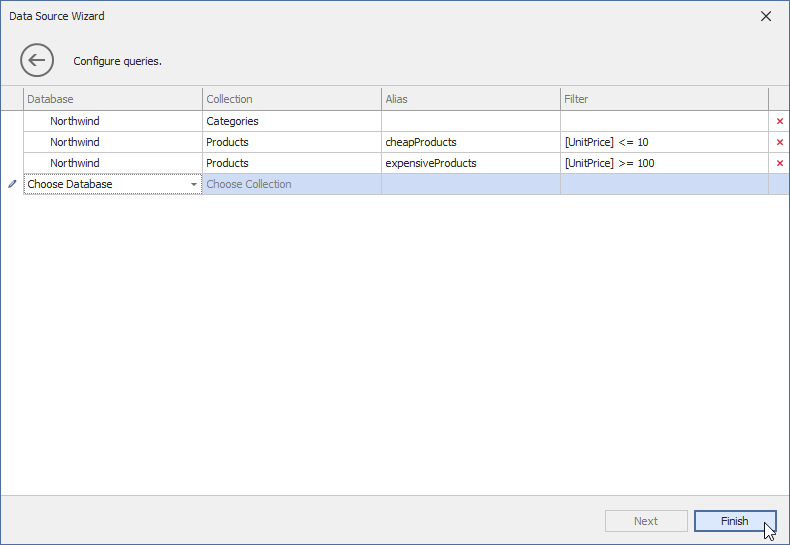
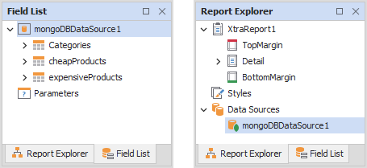
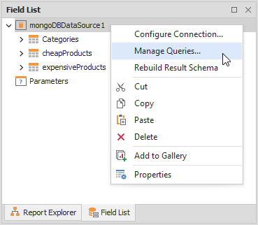
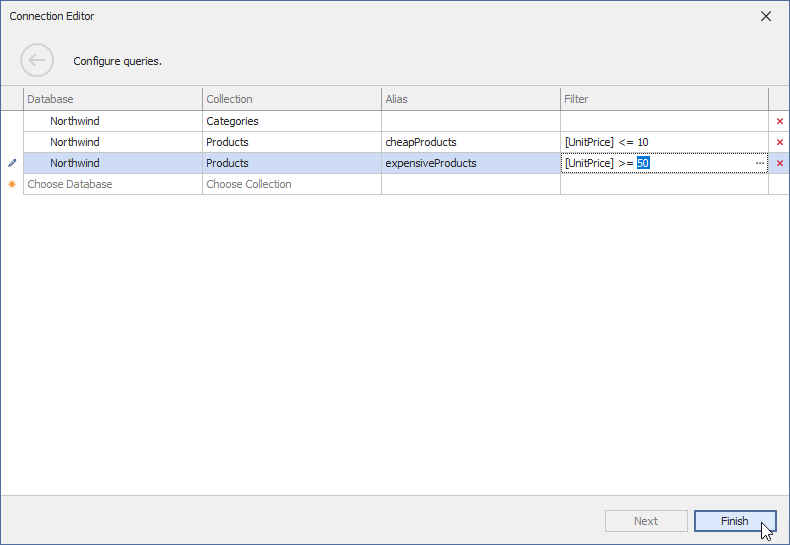

# Bind a Report to a MongoDB Instance

[Create a new project](../add-new-reports.md) and add a blank report to this project. Follow the steps below to bind the report to a MongoDB instance. 

## Invoke the Data Source Wizard

Click the report's smart tag, expand the drop-down menu for the **Data Source** property in the "Report Tasks" list, and click **Add Report Data Source**.

## Select the MongoDB Data Source

Select **MongoDB** in the invoked **Data Source Wizard** and click *Next*.

## Specify Connection Properties

Paste the entire string or enter connection fields individually. Refer to the following topic for information on connection string format and options: [Connection String URI Format](https://docs.mongodb.com/manual/reference/connection-string/).

## Specify Data Queries

On the next page, choose database collections that you want to load from the MongoDB instance. Specify the name of the database and database collection in the **Database** and **Collection** columns. You can use the **Filter** column to specify filter conditions for items of the database collections.

The names of queries to database collections should be unique. A string stored in a query's **Collection** column is the default name for this query. To create several queries to the same database collection, use the **Alias** column to specify different names for these queries.

## Use the Created MongoDB Data Source

The created data source appears in the [Field List](../report-designer-tools/ui-panels/field-list.md) and [Report Explorer](../report-designer-tools/ui-panels/report-explorer.md).

You can bind report controls to the fields from this data source. Refer to the following topic for more information: [Bind Report Controls to Data](../use-report-elements/bind-controls-to-data.md)

## Modify the Created MongoDB Data Source

You can change connection parameters and modify queries for the created data source. Right-click the data source node in the **Field List** or **Report Explorer** and select **Configure Connections** or **Manage Queries**.

Reconfigure the connection parameters or queries in the invoked **Connection Editor** and click *Finish*.

Right-click the data source node and select **Rebuild Result Schema** to apply the changes.

