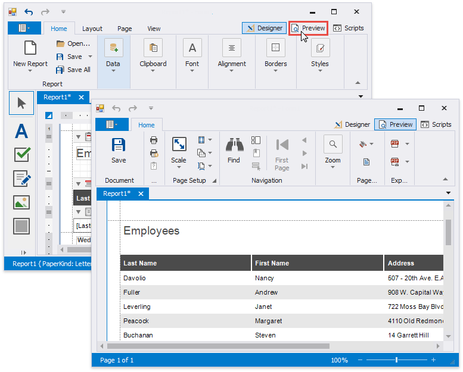
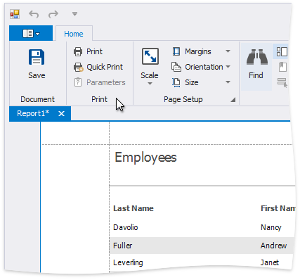
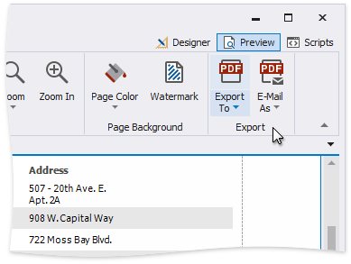
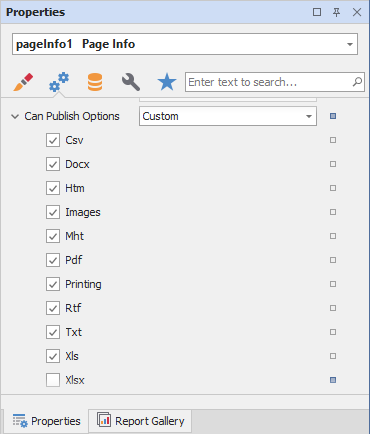
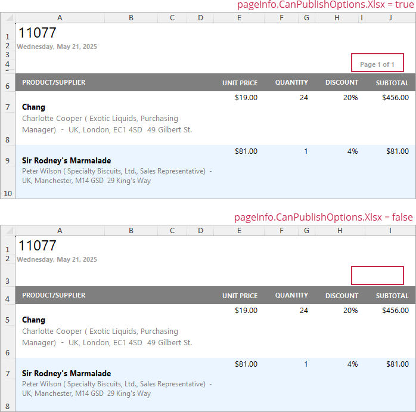

# Preview, Print and Export Reports

## Preview a Report
To switch a report to the print preview mode, click the **Preview** tab. You will see your report populated with data and broken down into pages, as specified.

> [!NOTE]
> To learn more about the options available in the print preview mode, refer to the [Print Preview for WinForms](~/interface-elements-for-desktop/articles/print-preview/print-preview-for-winforms.md) section of this documentation.

## Print a Report

When in the Print Preview mode, you can print out your report using the appropriate menu and toolbar commands.

## Export a Report

When in the Print Preview mode, you can export your report to files in different formats. The resulting files can either be saved to the hard drive or sent by e-mail.

The following documents describe the basics of report exporting and format-specific export options.
* [Exporting from Print Preview](~/interface-elements-for-desktop/articles/print-preview/print-preview-for-winforms/exporting/exporting-from-print-preview.md)
* [PDF-Specific Export Options](~/interface-elements-for-desktop/articles/print-preview/print-preview-for-winforms/exporting/pdf-specific-export-options.md)
* [HTML-Specific Export Options](~/interface-elements-for-desktop/articles/print-preview/print-preview-for-winforms/exporting/html-specific-export-options.md)
* [MHT-Specific Export Options](~/interface-elements-for-desktop/articles/print-preview/print-preview-for-winforms/exporting/mht-specific-export-options.md)
* [RTF-Specific Export Options](~/interface-elements-for-desktop/articles/print-preview/print-preview-for-winforms/exporting/rtf-specific-export-options.md)
* [XLS-Specific Export Options](~/interface-elements-for-desktop/articles/print-preview/print-preview-for-winforms/exporting/xls-specific-export-options.md)
* [XLSX-Specific Export Options](~/interface-elements-for-desktop/articles/print-preview/print-preview-for-winforms/exporting/xlsx-specific-export-options.md)
* [CSV-Specific Export Options](~/interface-elements-for-desktop/articles/print-preview/print-preview-for-winforms/exporting/csv-specific-export-options.md)
* [TXT-Specific Export Options](~/interface-elements-for-desktop/articles/print-preview/print-preview-for-winforms/exporting/txt-specific-export-options.md)
* [Image-Specific Export Options](~/interface-elements-for-desktop/articles/print-preview/print-preview-for-winforms/exporting/image-specific-export-options.md)

## Hide Report Controls in Documents Exported to Specific Formats

You can specify the **Can Publish Options** setting to exclude report controls from certain export formats in the Properties grid.

The following image illustrates the resulting XLXS document with and without page information:

## Export a Report to PDF with Accessible Tags (PDF/UA Compatibility)

You can specify how Label, Table, Table Row, and Table Cell should be treated by screen readers in the exported PDF document.

When you export a report to PDF, the report elements have no role. Assistive software commonly treats such elements as HTML 
 tags. Change the element’s role to one of the values listed below to help the screen reader correctly identify the element’s purpose in the exported PDF document.

### Define Label Accessible Role

Set the control’s **Accessible Role** property to **Heading 1 - Heading 6** before you export a report.

In the PDF Export Options dialog, set the **PDF/UA Compatibility** property to **PDF/UA1** to conform the exported PDF document to PDF/UA specification. Then, export the report to PDF format.

The image below shows the result. **Accessible Role** is set to **Heading 2**, and the screen reader treats **Label** as a “level two” heading in the exported document:

### Define Table Accessible Role

You can specify how Table should be treated by screen readers in the exported PDF document. For this, set the control's **Accessible Role** property to **Table** before you export a report.

In the PDF Export Options dialog, set the **PDF/UA Compatibility** property to **PDF/UA1** to conform the exported PDF document to PDF/UA specification. Then, export the report to PDF format.

The image below shows the result. **Accessible Role** is set to **Table**, and the screen reader treats Table as a table in the exported document:

### Define Table Row Accessible Role

You can specify how Table Row should be treated by screen readers in the exported PDF document. 

Before you export a report, set the **Table**'s **Accessible Role** property to **Table** to define a control as a table. Then, specify **Table Row**'s **Accessible Role**:

In the PDF Export Options dialog, set the **PDF/UA Compatibility** property to **PDF/UA1** to conform the exported PDF document to PDF/UA specification. Then, export the report to PDF format.

The image below shows the result. **Table Row**'s **Accessible Role** is set to **Table Header Row**, and the screen reader treats **Table Row** as a header row of the table in the exported document:

 

### Define Table Cell Accessible Role

Before you export a report, set the **Table**'s **Accessible Role** property to **Table** to define a control as a table. Then, specify the **Table Cell**'s **Accessible Role** property:

> [!NOTE]
> **Accessible Role** is not in effect for cells merged with the Cell's **Row Span** property. 

In the PDF Export Options dialog, set the **PDF/UA Compatibility** property to **PDF/UA1** to conform the exported PDF document to PDF/UA specification. Then, export the report to PDF format.

The image below shows the result. **Table Cell**'s b is set to **Table Header Cell**, and the screen reader treats Table Cell with "Bill to:" text as a header cell in the exported document:

