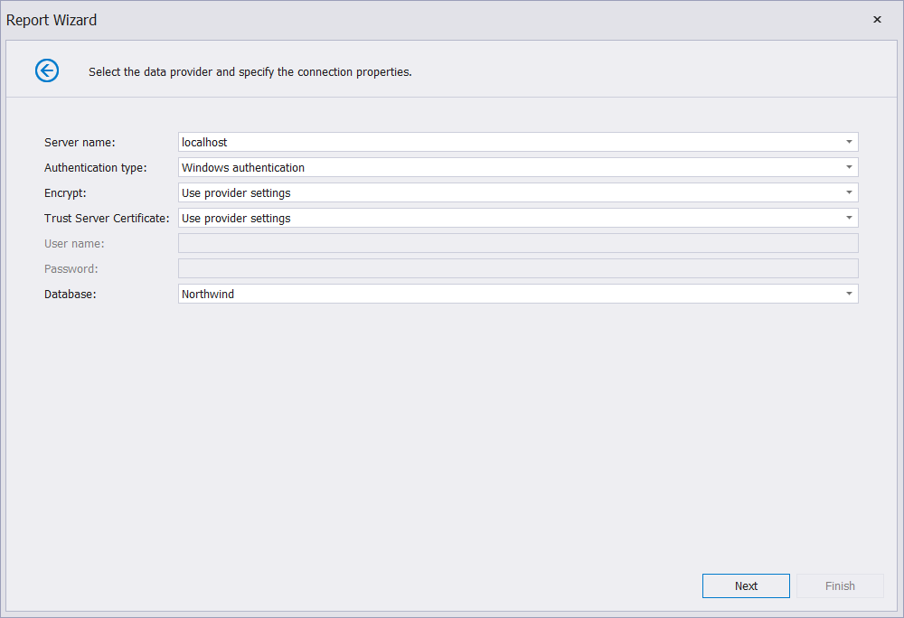

# Specify a Connection String

On this page, define a custom connection string or select one of the supported data source types.

The following data source types are supported.

* Amazon Redshift
* Firebird
* Google BigQuery
* IBM DB2
* Microsoft Access 2007
* Microsoft Access 97
* Microsoft SQL Server
* Microsoft SQL Server Compact Edition
* MySQL
* Oracle
* Pervasive PSQL
* PostgreSQL
* SAP HANA
* SAP Sybase Advantage
* SAP Sybase ASE
* SAP Sybase SQL Anywhere
* SQLite
* Teradata
* VistaDB
* VistaDB5
* XML file

Depending on the data provider selected, it may be necessary to specify additional connection options (such as authentication type and database name) on this page.

Click **Next** to proceed to the next wizard page, depending on whether or not the created connection uses server authentication.
* [Save the Connection String](save-the-connection-string.md) - if server authentication is required, this page allows you to specify whether or not you want to save the user credentials along with the connection string.
* [Create a Query or Select a Stored Procedure](create-a-query-or-select-a-stored-procedure.md) - if server authentication is not required, the page above does not appear, and you will proceed to constructing the query.