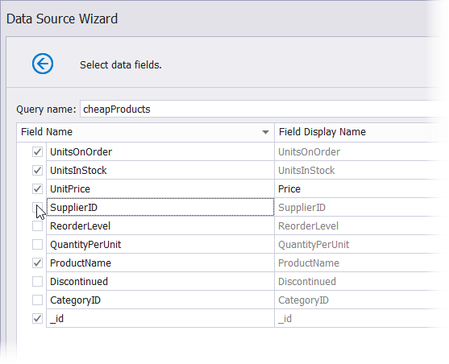

# Select Data Fields

This wizard page allows you to select data fields that you want to include in a MongoDB collection and also change their display names.

Use the drop-down menu to select a collection whose data fields you want to configure.

Enable or disable a checkbox in the Field Name column to include or remove a field from a collection.

Use editors in the Field Display Name column to change the default field name.