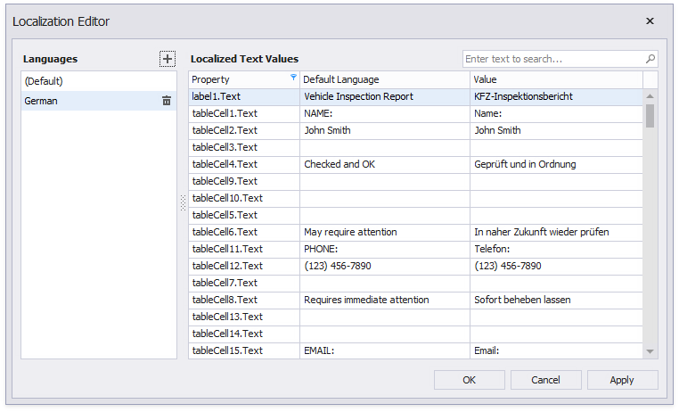
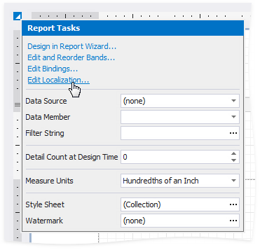
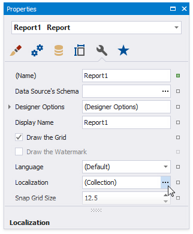
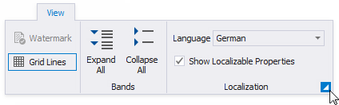

# Localization Editor

The Localization Editor allows you to change the text of the localizable textual properties for all the controls in a report.

The left panel allows you to change the report's language or add a new language to start localization.
The right panel contains a grid that displays the property name, the text specified for that property in the default language, and the text for the selected language. Text strings of the selected language are editable.

## Invoke the Localization Editor

Use one of the following actions:

* Click the report's smart tag in the Report Designer and select **Edit Localization** in the action list:

    

* Click the **Localization** property's ellipsis button in the [Property Grid](ui-panels/property-grid-tabbed-view.md):

    

* Click the **dialog box launcher** in the [Toolbar](ui-panels/toolbar.md)'s Localization group:

    

## Use the Localization Editor

* **To add a new language**, click the _plus_ button at the right panel. All values for the new language are copied from the default language's values.

* Change the text and click **Apply** to apply your changes and preview the text in the report designer.

* Click **OK** to apply changes and close the editor.

> [!Tip]
> When the **Localization Editor** is invoked, the grid in the right panel displays values for the report controls' **Text** properties. You can click the **Property** column header to modify a filter and select other properties or clear the filter to show all textual properties.
> Grid rows are arranged in the same order as report controls in the [Report Explorer](ui-panels/report-explorer.md) tree - from top to bottom and from left to right.
