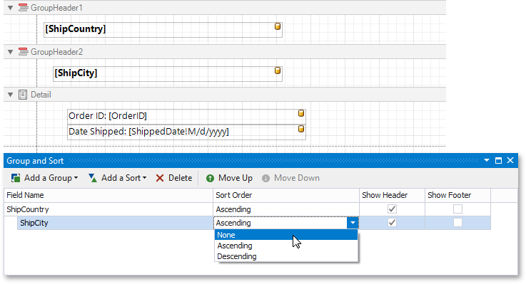

# Group and Sort Panel
The **Group and Sort Panel** allows you to quickly apply [grouping](../../shape-report-data/group-and-sort-data/group-data.md) and [sorting](../../shape-report-data/group-and-sort-data/sort-data.md) to your report data.

To create a new grouping or sorting criterion, simply click **Add a Group** or **Add a Sort**.

Then, to control whether the corresponding [Group Header or Footer band](../../introduction-to-banded-reports.md) should be displayed, use the **Show Header** and **Show Footer** check boxes.

The **Sort Order** drop-down list allows you to specify a sorting mode (ascending or descending) or disable sorting.

You can change the order in which multiple grouping and sorting criteria are to be performed, using the **Move Up** and **Move Down** buttons.

To remove a grouping or sorting criterion, select it, and click **Delete**.

> [!NOTE]
> If the Group and Sort Panel is hidden, you can enable it To do this, select  in the **Windows** | **Group and Sort** on the [Toolbar](../toolbar.md)'s **View** page.