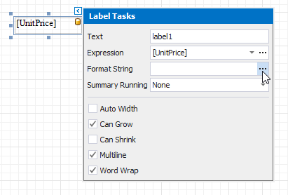
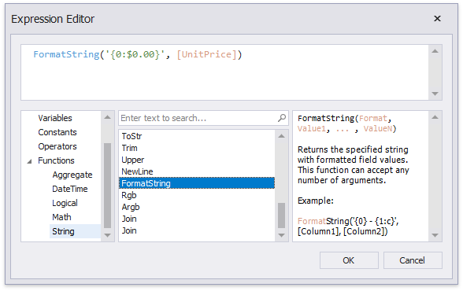

# Format Data

This document demonstrates how to specify value formatting for report elements (for instance, format numeric values as a currency or apply a percent format).

After you [bound your report to data](../bind-to-data.md) and specified a bound data field in a report control's **Expression** property, you can format data values in a report.

1. Invoke the control's smart tag and click the **Format String** property's ellipsis button.
	
	

2. This invokes the **Format String Editor** where you can specify the required format.
	
	

Alternatively, you can use the **FormatString** function within the expression you specified for the report control.

When switching to [Print Preview](../preview-print-and-export-reports.md), you can view the report control displaying values with the specified format.

You can use the control's **Xlsx Format String** property to assign a native Excel format that is used for exporting reports to [XLSX](../../../print-preview/print-preview-for-winforms/exporting/xlsx-specific-export-options.md).