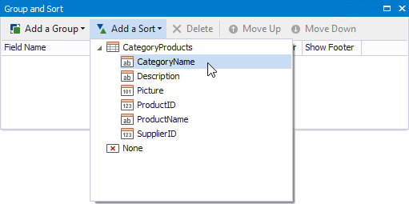
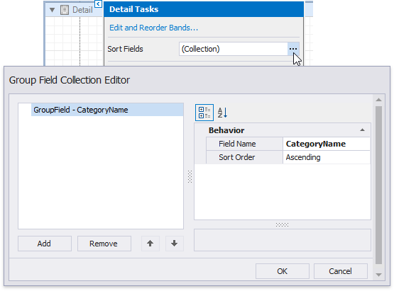
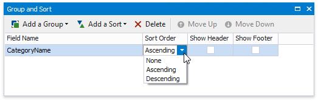
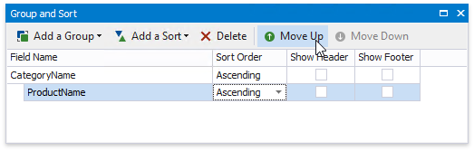
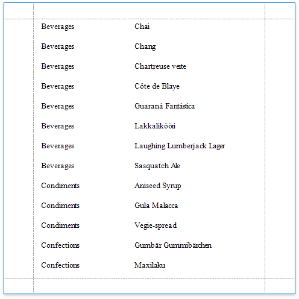
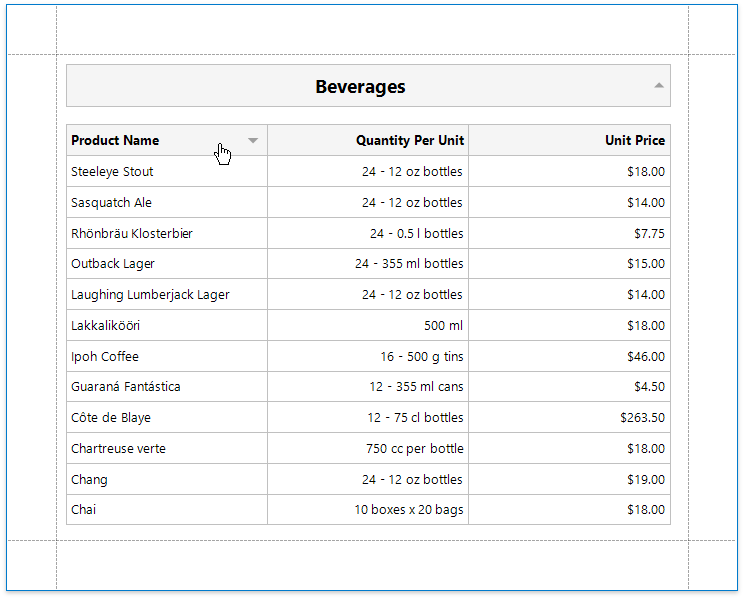

# Sort Data

## Sort a Report's Data
Do the following to sort data in your report:

1. Create a new or open an existing data-bound report.
	
	You cannot apply sorting unless your report is bound to a data source.
2. Switch to the [Group and Sort](../../report-designer-tools/ui-panels/group-and-sort-panel.md) panel, click **Add a Sort** and select the required data field in the invoked drop-down menu.
	
	
	
	> [!Note]
	> See the [Sort Data by a Custom Field](sort-data-by-a-custom-field.md) tutorial to learn how to sort a report's data by a custom field.
	
	This adds a corresponding sort field to the **Sort Fields** collection. You can access this collection by clicking the Detail band's smart tag.
	
		

3. Back in the **Group and Sort** panel, you can specify the sort order (ascending or descending).
		
	
		
4. When a report has multiple sort fields, you can change their order by clicking **Move Up** or **Move Down**.
	
	
	
6. Drag the corresponding field from the [Field List](../../report-designer-tools/ui-panels/field-list.md) onto the report area and switch to [Print Preview](../../preview-print-and-export-reports.md) to see the result.

    

## Interactive Sorting in Print Preview
You can allow sorting report data directly in Print Preview by clicking a designated element.

See [Sort a Report in Print Preview](../../provide-interactivity/sort-a-report-in-print-preview.md) for more information.