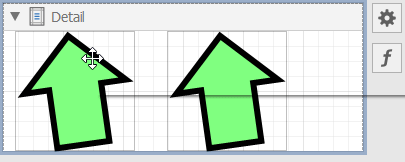
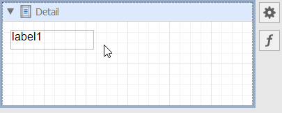
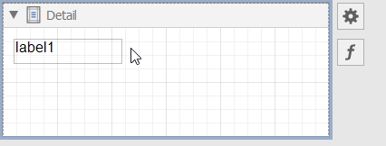
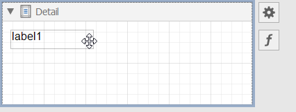
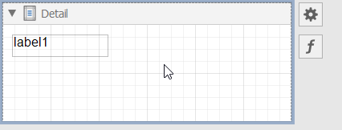
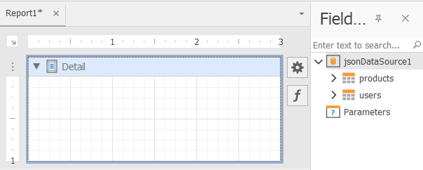
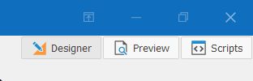

# WinForms End-User Report Designer Keyboard Shortcuts

## Operations with XRControls

### Copy/Paste XRControl

| Key | Action |
|----------|----------|
| Ctrl+C    | Copy the selected XRControl.     |
| Ctrl+V    | Paste the copied XRControl.     |

### Cut XRControl

| Key | Action |
|----------|----------|
| Ctrl+X    | Cut the selected XRControl.     |

### Delete XRControl

| Key | Action |
|----------|----------|
| Delete    | Remove the selected XRControl.    |

### Undo / Redo an Action

| Key | Action |
|----------|----------|
| Ctrl+Z    | Undo the last operation.     |
| Ctrl+Y    | Repeat the last undone operation.     |

### Slide XRControl to the End of the Area with a Minimum Indent

Use arrow keys to slide XRControl to the end of the area with a minimum indent:

| Key | Action |
|----------|----------|
| Up     | Slide XRControl up.     |
| Down   | Slide XRControl down.   |
| Left   | Slide XRControl left.   |
| Right  | Slide XRControl right.  |

### Shift XRControl Pixel by Pixel

Use `Ctrl` + arrows to shift XRControl pixel by pixel:

| Key | Action |
|----------|----------|
| Ctrl+Up     | Shift XRControl one pixel upward.    |
| Ctrl+Down   | Shift XRControl one pixel down.   |
| Ctrl+Left   | Shift XRControl one pixel to the left.   |
| Ctrl+Right  | Shift XRControl one pixel to the right.  |

### Resize XRControl to the Widest/Highest Possible Value

| Key | Action |
|----------|----------|
| Shift+Up   | Move the XRControl's bottom border to the lowest possible value.   |
| Shift+Down  | Move the XRControl's bottom border to the highest possible value.   |
| Shift+Right  | Move the XRControl's right border to the widest possible value.  |
| Shift+Left  | Move the XRControl's right border to the narrowest possible value.  |

### Resize XRControl Pixel by Pixel

| Key | Action |
|----------|----------|
| Ctrl+Shift+Up     | Move the XRControl's bottom border upward by one pixel.    |
| Ctrl+Shift+Down   | Move the XRControl's bottom border downward by one pixel.   |
| Ctrl+Shift+Left   | Move the XRControl's right border to the left by one pixel.  |
| Ctrl+Shift+Right  | Move the XRControl's right border to the right by one pixel.  |

### Clone XRControl

| Key | Action |
|----------|----------|
| Ctrl+Drag     | Clone XRControl.    |

### Select Multiple XRControls 

| Key | Action |
|----------|----------|
| Ctrl+Click or Shift+Click     | Select/unselect multiple XRControls.   | 

### Rotate XRShape

| Key | Action |
|----------|----------|
| Ctrl+Drag   | Rotate XRShape.   | 

## Operations with the Field List

| Key | Action |
|----------|----------|
| Drag a table  | Add XRTable with bindings to all data fields.   | 

| Key | Action |
|----------|----------|
| Shift + Drag a table  | Add XRTable with all data field names.   | 

## Operations with the End-User Report Designer

| Key | Action |
|----------|----------|
| F4  | Switch to the Designer tab.   |
| F5  | Switch to the Preview tab.   | 

 
| Key | Action |
|----------|----------|
| Ctrl+L  | Save all opened report layouts.   |
| Ctrl+S  | Save the selected report layout.   |
| Ctrl+O  | Open a `.repx` report.   |
| Ctrl+N  | Create a new report.   |
| Ctrl+W  | Create a new report with the Wizard.   |
| Ctrl+ScrollDown`  | Zoom in the selected report.   |
| Ctrl+ScrollDown  | Zoom out the selected report.   |
| Ctrl+0  | Set zoom to 100%.  |