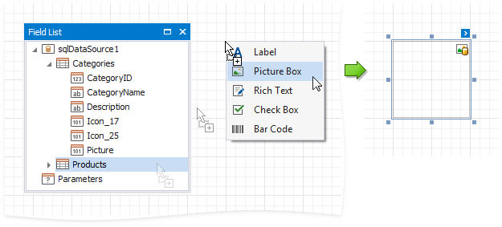
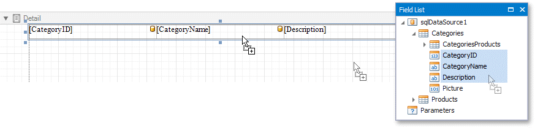

# Add Controls to a Report

This document describes how to add [controls](../../../../../articles/report-designer/report-designer-for-winforms/use-report-elements.md) to a report.

## Add Controls from the Standard Controls Bar

Use the End-User Designer's [Toolbox](../../../../../articles/report-designer/report-designer-for-winforms/report-designer-tools/ui-panels/toolbox.md) to add controls to your report.

## Add Data-Bound Controls from the Field List

You can drag fields from the [Field List](../../../../../articles/report-designer/report-designer-for-winforms/report-designer-tools/ui-panels/field-list.md) onto your report to add data-bound controls, after you [bound](../../../../../articles/report-designer/report-designer-for-winforms/bind-to-data.md) your report to a data source.

### Add a Control

Drag a field from the [Field List](../../../../../articles/report-designer/report-designer-for-winforms/report-designer-tools/ui-panels/field-list.md) and drop it onto the report's surface.

To add a control of specific type, do either of the following:

* Hold down the SHIFT key and drop a data field onto a report's surface.
* Right-click a data field and drop it onto a report's surface.

This invokes a context menu where you can select which control to add.

### Add a Table

Hold the CTRL or SHIFT key and click several fields. Drop them onto the report's surface to add a table with its cells bound to these fields.

Drop an entire data table from the [Field List](../../../../../articles/report-designer/report-designer-for-winforms/report-designer-tools/ui-panels/field-list.md) to add a report table with columns bound to the data table's fields.

To add column headers, do either of the following:

* Select the fields and hold the CTRL or SHIFT key when you drop them onto a report surface.
* Drag and drop fields with the right mouse button.

 This adds a new table whose cells display the field names.

## Add Content from External Sources

You can add text and graphics from external applications to your reports:

* Drag a file, text or image from an external application onto your report.

	

* Copy a file, text or image from an external application, and paste it into your report.

	

The following table shows which file types transform into report controls:

| File Type | Control |
| --- | --- |
| .TXT | A [Label](../../../../../articles/report-designer/report-designer-for-winforms/use-report-elements/use-basic-report-controls/label.md) control that contains file contents. |
| .DOC, .DOCX, .RTF, .HTM, .HTML | A [Rich Text](../../../../../articles/report-designer/report-designer-for-winforms/use-report-elements/use-basic-report-controls/rich-text.md) control that contains file content. |
| .JPG, .PNG, .BMP, .GIF, .TIF, .SVG | A [Picture Box](../../../../../articles/report-designer/report-designer-for-winforms/use-report-elements/use-basic-report-controls/picture-box.md) control that contains the image. |