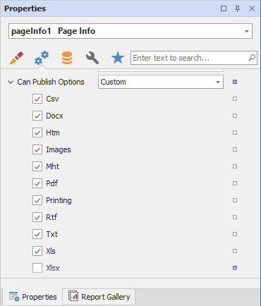
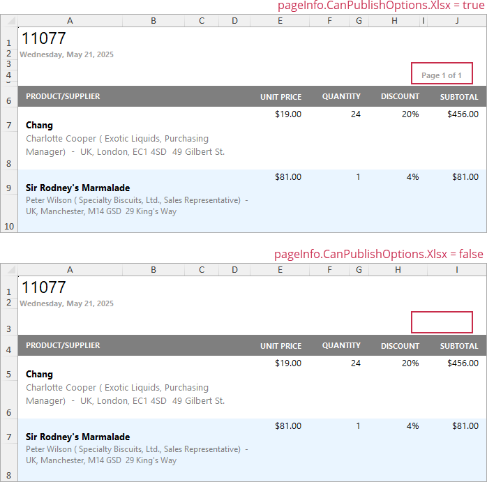

# Hide Report Controls in Exported Documents and Printouts

You can specify the **Can Publish Options** setting in the Properties grid to exclude report controls on printouts or when exported to a document in a certain format.

The following formats are available:

* Csv - specifies report control visibility when exporting to CSV.
* Docx - specifies report control visibility when exporting to DOCX.
* Htm - specifies report control visibility when exporting to HTM.
* Image - specifies report control visibility when exporting as an image.
* Mht - specifies report control visibility when exporting to MHT.
* Pdf - specifies report control visibility when exporting to PDF.
* Printing - specifies report control visibility on printouts.
* Rtf - specifies report control visibility when exporting to RTF.
* Txt - specifies report control visibility when exporting to TXT.
* Xls - specifies report control visibility when exporting to XLS.
* Xls - specifies report control visibility when exporting to XLS.
* All - specifies whether the control is visible on printouts and in all exported documents.
* None - hides a report control on printouts and in all exported documents.

The following image illustrates the resulting XLXS document with and without page information:

