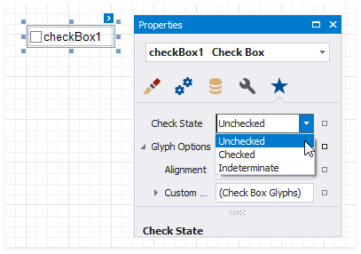
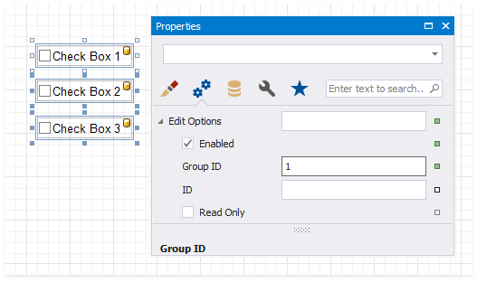
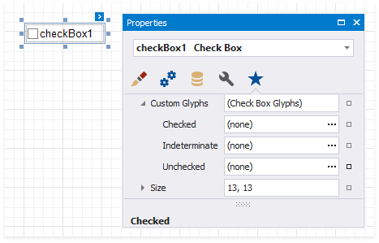
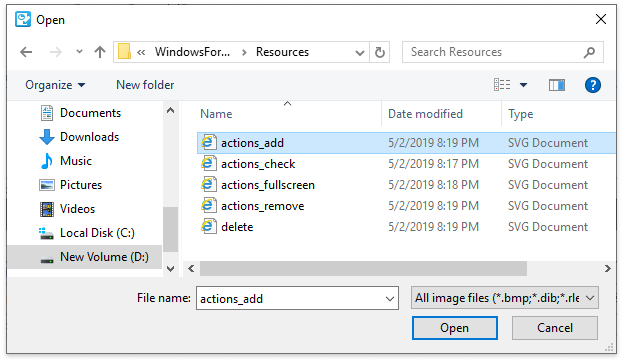

# Check Box

The **Check State** property specifies the checkbox's state.

The **Checked** property indicates whether the checkbox is checked (displays a check mark) or not (is empty).

The **Text** property specifies the checkbox's caption. Double-click the checkbox to invoke its in-place editor and type the caption text.

## Bind to Data

Drag a Boolean field from the [Field List](../../../../../articles/report-designer/report-designer-for-winforms/report-designer-tools/ui-panels/field-list.md) onto your report. This adds a new checkbox to your report and binds its **Check State** property to the dragged field.

If you add a checkbox from the [Toolbox](../../../../../articles/report-designer/report-designer-for-winforms/report-designer-tools/toolbox.md), click the control's [smart tag](../../../../../articles/report-designer/report-designer-for-winforms/use-report-elements/manipulate-report-elements/select-report-elements-and-access-their-settings.md), expand the **CheckState** property's **Expression** drop-down list and select a data field. This [binds](../bind-controls-to-data.md) your control's **CheckState** property to a data source field.

The data field value specifies the checkbox's state:

* **True** or **1** - activates the **Checked** state;
* **False** or **0** - activates the **Unchecked** state;
* Any other value - activates the **Indeterminate** state.

You can [bind](../bind-controls-to-data.md) your control's **CheckState** the checkbox caption to a data source field. Click the control's [smart tag](../../../../../articles/report-designer/report-designer-for-winforms/use-report-elements/manipulate-report-elements/select-report-elements-and-access-their-settings.md), expand the **Expression** drop-down list and select the data field.

The **Expression** option's ellipsis button invokes the **Expression Editor**. This Editor allows you to construct a complex binding expression with two or more fields.

Refer to the [Bind Controls to Data](../bind-controls-to-data.md) topic for more information about the available data binding modes and how to create data-aware controls.

## Interactivity

Change the **Enabled** checkbox within the **Edit Options** group to specify if users can [change the checkbox state](../../../../../articles/report-designer/report-designer-for-winforms/provide-interactivity/edit-content-in-print-preview.md) in Print Preview.

You can create checkbox groups to make them behave like radio lists. To group checkboxes, set their **Group ID** option within the **Edit Options** group a group ID value.

## Customization

The **Glyph Options** property provides access to glyph settings.

* **Style** - specifies a predefined glyph style.

  

* **Alignment** - specifies the glyph's alignment within the control.

  

* **Size** - specifies the glyph size.

* **Custom Glyphs** - specifies a custom glyph image for each checkbox state (Checked/Unchecked/Indeterminate).

    

    The **Open File** dialog is invoked when you specify custom glyphs.

    

    The selected glyph image is saved to the report definition .repx file.