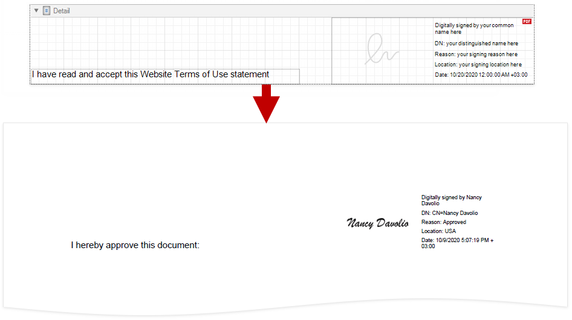
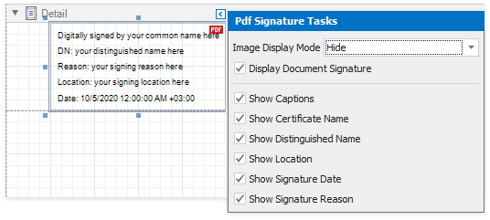

# PDF Signature

**PDF Signature** is a control that adds a visual signature to a report exported to PDF.

You can sign a report document when you [export it to PDF](../../../../print-preview/print-preview-for-winforms/exporting/exporting-from-print-preview.md). The signature information you specify is saved to the document's **PDF Signature Options**. The **PDF Signature** control visualizes the document signature information:

* Certificate name
* Distinguished name
* Location
* Signature date
* Signature reason

> [!TIP]
> For more information on how to create, export, and sign a report, refer to the following tutorial: [Reports with a Visual PDF Signature](../../create-reports/reports-with-visual-pdf-signature.md).

## Add a Signature Control to a Report

Drop the **PDF Signature** control from the **Toolbox** onto a report.

## Report with Multiple Signatures

The first **PDF Signature** control is added to a report with the **Display Document Signature** property enabled. This control visualizes the document signature information.

Other **PDF Signature** controls are added with the **Display Document Signature** property disabled. When a report is exported to PDF, these controls are converted to signature form fields. Users can open an exported file in a PDF editor and put their signatures in these fields.

Enable a control's **Display Document Signature** property to make it visualize the document's signature information. This property becomes disabled for all other signature controls.

If all signature controls have the **Display Document Signature** property disabled, the signature information is added to an exported file but is not displayed.

## Specify Signature Options

Expand the control's smart tag and enable check boxes for the signature fields that you want to display.

* **Image Display Mode**

  Specifies whether the control shows the signature image. The following property values are available:

  * **Show**

    The control shows a sample signature image. If an exported document is signed, the converted PDF form field shows the actual signature image.

    

  * **Hide**

    The control does not show a signature image.

    

  * **Show Certificate Name As Image**

    The control shows a sample certificate name in place of a signature image. When an exported document is signed, the converted PDF form field shows the actual certificate name.

    

* **Display Document Signature**

  Specifies whether the control displays the document signature information. For more information, refer to the following section: [Report with Multiple Signatures](#report-with-multiple-signatures).

The signature control shows the **certificate name**, **distinguished name**, **location**, **signature date**, and **signature reason**. Disable the corresponding options in the control's smart tag to hide these fields.

  

Disable the **Show Captions** property to exclude captions from the fields listed above.

  | Show Captions Enabled | Show Captions Disabled |
  | --- | --- |
  |  |  |

## Limitations

The **PDF Signature** control is not exported to non-PDF formats. A placeholder is added to exported documents instead.
