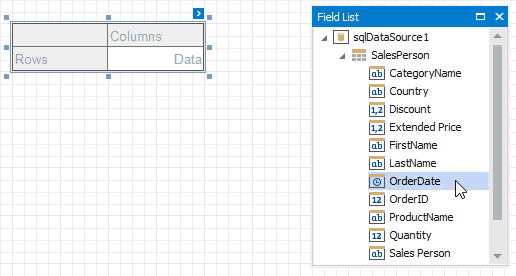
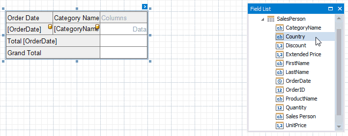
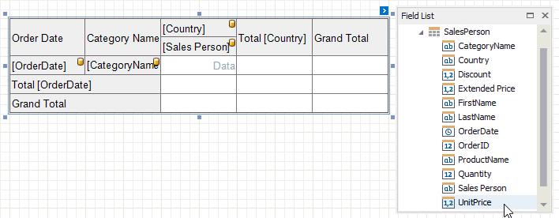
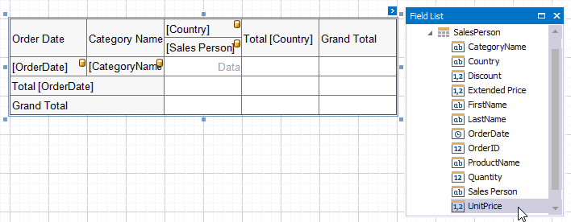
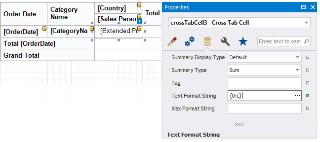

# Cross Tab Fields

Drop data fields from the [Field List](../../report-designer-tools/ui-panels/field-list.md) onto cross-tab areas to define the control layout. The Cross Tab supports three field types (areas):

* **Rows** (the **Row Fields** collection) - displays field values as row headers.

* **Columns** (the **Column Fields** collection) - displays field values as column headers.

* **Data** (the **Data Fields** collection) - uses field values to calculate summaries at row and column intersections.

> [!Tip]
> You can also use [calculated fields](../../shape-report-data/use-calculated-fields.md) if data source fields do not suit your requirements and you need to pre-process data before it is shown in the Cross Tab.

## Row and Column Fields

You can drop two or more data fields onto the same area to create a hierarchy. The first field's values are displayed at the root level (the first column/row), the second field's values are grouped by the first field's values and displayed at the second hierarchy level (the second column/row), and so on.

* **Specify Row Fields**

  

* **Specify Column Fields**

  

Cross Tab cells marked with a database icon become bound to the dropped fields. The corresponding rows/columns are printed in the document as many times as there are field values in the data source. The top left corner displays headers for row data fields. 

Additional rows/columns are added to the Cross Tab to display total values calculated against these fields. The last row/column displays grand total values calculated against all the rows/columns.

## Data Fields

You can add two or more data fields and arrange them in two ways:

* in a column, one under the other (field headers are displayed as row headers);

  

* in a row, one after the other (field headers are displayed as column headers);

   

When the data area contains only one field, the field header is not displayed.

> [!NOTE]
> * You cannot bind the top left corner, row/column totals, and row/column grand totals;
> * You cannot bind Cross Tab cells to [report parameters](../../use-report-parameters.md);
> * You can only bind Cross Tab cells to fields from a data source and data member assigned to the **Data Source** and **Data Member** properties.

## Format Field Values

Use a cell's **Text Format String** property to format output data.

You can also use the **Null Value Text** property to specify the text shown when a data field's value is null or empty.