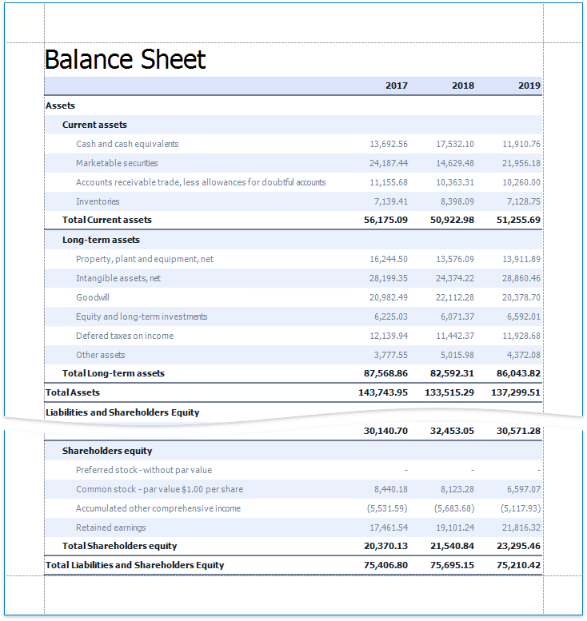
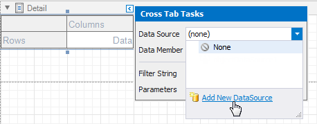

# Cross Tab Overview

Use the **Cross Tab** control to display multi-dimensional data, such as summary statistics, surveys, and market research information.

## Add a Cross Tab to a Report

Drag the **Cross Tab** item from the Toolbox onto a report.

You cannot place the Cross Tab in another report control ([Table Cell](../use-tables.md) or [Panel](../use-basic-report-controls/panel.md)) because its width cannot be determined at design time.

## Bind to Data

Use the Cross Tab's **Data Source** and **Data Member** properties to bind this control to data.

1. Click the Cross Tab's smart tag.
2. Expand the **Data Source** property's drop-down list and click **Add New Data Source**.
3. Follow the steps in the invoked [Data Source Wizard](../../report-designer-tools/data-source-wizard.md) to configure a data source.

If these properties are not set, the Cross Tab uses its parent report's data source (the report's **Data Source** and **Data Member** properties).

> [!Note]
> If you place a Cross Tab in the [Detail band](../../introduction-to-banded-reports.md), ensure that the report's **Data Source** property is not set. Otherwise, the Cross Tab data is printed as many times as there are rows in the report data source.

The following step-by-step tutorials describe how to create reports that use the Cross Tab control:

* [Create a Cross-Tab Report](../../create-reports/cross-tab-reports.md) - Use the [Cross-Tab Report Wizard](../../report-designer-tools/report-wizard/cross-tab-report.md) to create a report.
* [Balance Sheets](../../create-reports/balance-sheets.md) - Configure a Cross Tab on the design surface.
