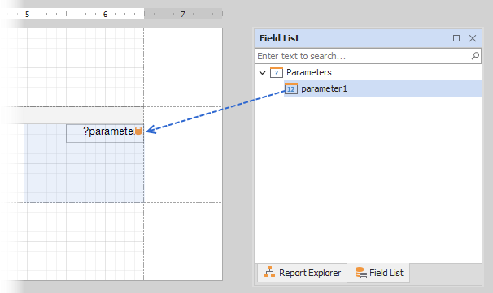
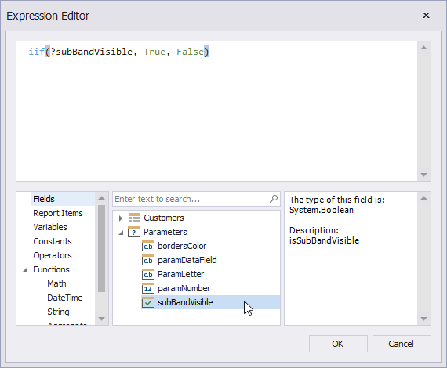
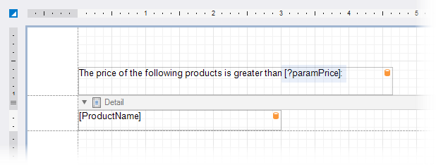
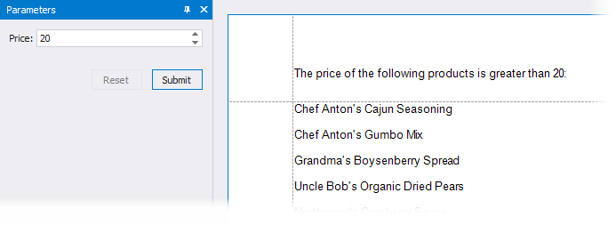

# Reference Report Parameters

After you [create a report parameter](create-a-report-parameter.md), you can reference this parameter in the [report's filter string](#reference-in-a-reports-filter-string), [in expressions](#reference-in-expressions), and [in a control's Text property](#reference-in-a-controls-text-property). You can also bind control and data source parameters to report parameters. Refer to the sections below for more details.

## Reference in a Report's Filter String

You can reference a report parameter in the report's filter string. This allows you to conditionally filter the report's data loaded from a data source.

> [!TIP]
> When you use a report's filter string to filter data, all the data is loaded from a data source before the filter is applied. If you use a large dataset, filter data at the data source level. Refer to the following topic for more information: [Filter Data at the Data Source Level](../shape-report-data/filter-data/filter-data-at-the-data-source-level.md). 

## Reference in Expressions

You can reference a report parameter in [expressions](../use-expressions.md) of [controls](../use-report-elements/use-basic-report-controls.md) and [calculated fields](../shape-report-data/use-calculated-fields/calculated-fields-overview.md).

This allows you to conditionally change the data a control or calculated field displays.

You can use the [Field List](../report-designer-tools/ui-panels/field-list.md) to create an [Label](../use-report-elements/use-basic-report-controls/label.md) control that displays only a parameter value. To do this, drag the parameter from the **Field List** and drop it onto the report's band.
 

You can also use parameters in expressions to specify the visibility of a report's bands or conditionally change a control's appearance.

Refer to the following topics for more information:

* [Conditionally Change a Band's Visibility](../shape-report-data/specify-conditions-for-report-elements/conditionally-change-a-bands-visibility-expression-bindings.md)
* [Conditionally Change a Control's Appearance](../shape-report-data/specify-conditions-for-report-elements/conditionally-change-a-control-appearance.md)

## Reference in a Control's Text Property

You can use a report parameter in a control's **Text** property.

This allows you to create a placeholder (embedded field) that is substituted by a parameter value. 

Refer to the following topic for information on embedded fields: [Use Embedded Fields (Mail Merge)](../use-report-elements/use-embedded-fields-mail-merge.md).

## Bind Control Parameters to Report Parameters

You can create parameters for the [CrossTab](../use-report-elements/use-cross-tabs.md) and [Chart](../use-report-elements/use-charts-and-pivot-grids/use-charts-in-reports.md) controls and bind these parameters to report parameters. This allows you to conditionally filter data at the control level. Refer to the following topic for details on how to filter data for the **Сhart** control: [Use Charts to Visualize Grouped Data](../use-report-elements/use-charts-and-pivot-grids/use-charts-to-visualize-grouped-data.md).

You can also specify a parameter for the [Subreport](../use-report-elements/use-basic-report-controls/subreport.md) control and bind this parameter to report parameters. This allows you to pass parameter values from the main report to the subreport and conditionally change the subreport's data and appearance.
 
## Bind Data Source Parameters to Report Parameters

You can create parameters for data sources and bind them to report parameters. The table below contains information about which tasks this allows you to solve, a data source for which the task can be solved, and links to documentation sections you can reference for details.

| Task | Data Source | Documentation |
| --- | --- | --- |
| **Filter data at the data source level** | SQL Data Source   Entity Framework Data Source   MongoDB Data Source | [Bind a Report to a Database](../bind-to-data/bind-a-report-to-a-database.md)   [Bind a Report to an Entity Framework Data Source](../bind-to-data/bind-a-report-to-an-entity-framework-data-source.md)   [Bind a Report to a MongoDB Instance](../bind-to-data/bind-a-report-to-a-mongodb-instance.md) |
| **Pass report parameters to a stored procedure** | SQL Data Source   Entity Framework Data Source | [Specify Query Parameters](../bind-to-data/specify-query-parameters.md)   [Bind a Report to an Entity Framework Data Source](../bind-to-data/bind-a-report-to-an-entity-framework-data-source.md) |
| **Pass report parameters to a method that loads data** | Object Data Source | [Bind a Report to an Object Data Source](../bind-to-data/bind-a-report-to-an-object-data-source.md) |

When you bind a report to the JSON Data Source, you can specify a URI from which a JSON file should be loaded. You can bind path parameters, query parameters, and header parameters to report parameters to conditionally configure HTTP requests to the web service endpoint. Refer to the following topic for details: [Bind a Report to JSON Data](../bind-to-data/bind-a-report-to-json-data.md).