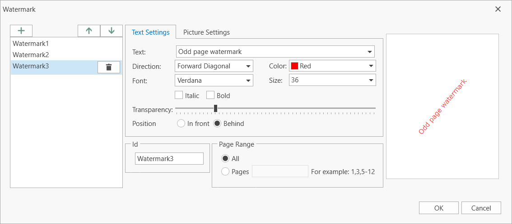
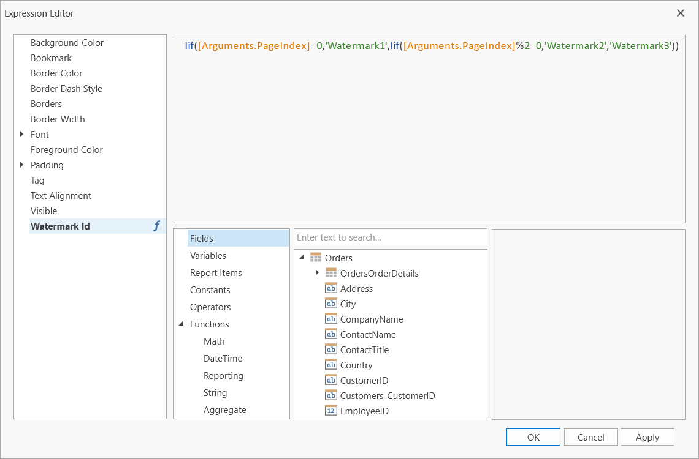
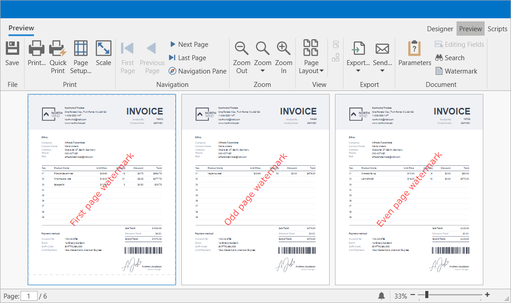

# Create or Modify Watermarks of a Report

DevExpress Reporting allows you to display text and picture watermarks on report pages. You can also specify an expression that assigns different watermarks to pages.

* How to add watermarks.

* How to specify watermark settings.

* How to use pre-printed forms.

## Add a Watermark to a Report

Right-click the report, and in the invoked context menu, click the **Watermark...** link. In the invoked **Watermarks** dialog, add a new watermark and click either the **Text Watermark** or **Picture Watermark** tab, depending on the type of watermark you wish to add.

## Specify Text Watermark Settings

Specify the following settings:

* Text

	The watermark’s text.

* Direction

	The incline of the watermark’s text.

* Font

	The font of the watermark’s text.

* Color

	The foreground color of the watermark’s text.

* Size

	The size of the watermark’s text.

* Bold

	Formats the watermark’s text as bold.

* Italic

	Formats the watermark’s text as italic.

* Position

	Specifies whether a watermark should be printed behind or in front of page content.

* Transparency

	The transparency of the watermark’s text.

* Id

	The unique identifier of a watermark used to specify the watermark in the WatermarkId property (See the Manage Watermark Collection section for details).

* Page Range

	The range of pages which contain a watermark.

Click **OK** to add a watermark to the watermark collection. The added watermark is automatically displayed in the report in Preview mode.

> [!NOTE]
> A report can display only one watermark on a report page.

## Specify Picture Watermark Settings

Specify an image. Click the **Load image** option’s **Image** button.

In the invoked **Select Picture** dialog, select the file containing the image that you wish to use as a watermark and click **Open**.

Specify the following picture options:

* Size Mode

	The mode in which a picture watermark is displayed.

* Tiling

	Specifies whether a picture watermark should be tiled.

* Horizontal Alignment

	Specifies the horizontal alignment of the watermark.

* Vertical Alignment

	Specifies the vertical alignment of the watermark.

* Position

	Specifies whether a watermark should be printed behind or in front of page content.

* Transparency

	The transparency of the watermark’s image. The **Transparency** property is unavailable when you specify an SVG image.

* Id

	The unique identifier of a watermark used to specify the watermark in the WatermarkId property (See the Manage Watermark Collection section for details).

* Page Range

	The range of pages which contain a watermark.

Click **OK** to add a watermark to the watermark collection. The added watermark is automatically displayed in the report in Preview mode.

> [!NOTE]
> A report can display only one watermark on a report page.

## Combine Text and a Picture in One Watermark

You can display both text and a picture in one watermark.

For example, create a watermark and specify its text and picture settings. Set position of the text to In front and the position of the picture to Behind.
 
As a result, in [Preview](../../document-preview.md) mode the image is displayed behind the table, while the text is in front of the content:

## Display a Specific Watermark in a Report

The report's **Watermark Id** property allows you to specify a watermark from the collection to display in the report by the watermark's unique identifier (the Id option's value of the watermark). This property has a priority over the watermark’s **Page Range** property.

## Display Watermarks According to the Specified Condition

Bind **Watermark Id** to an expression to apply watermarks stored in the collection to specific report pages.

Create the “First page watermark”, “Even page watermark”, and “Odd page watermark” watermarks with the following settings:

Specify the expression in the report’s **Watermark Id** property:

`Iif([Arguments.PageIndex]=0,'Watermark1',Iif([Arguments.PageIndex]%2=0,'Watermark2','Watermark3'))`

The image below shows the result.

