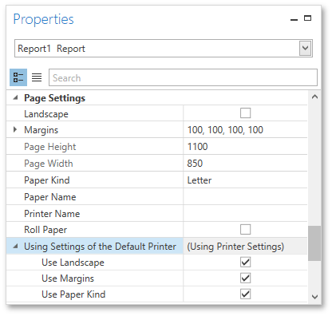
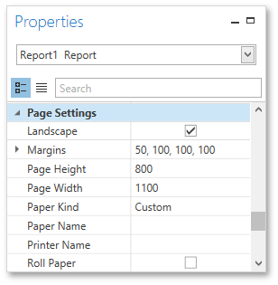
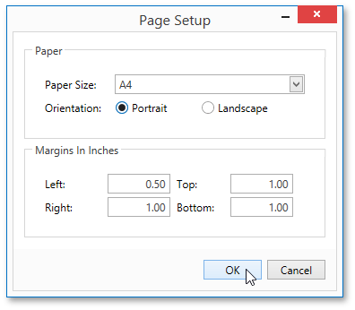

# Adjust Page Layout Settings
In the Report Designer, page settings of a report can be specified in one of two ways. The first approach forces the default printer settings to be used when the report is printed, while the other one enables you to alter page settings independently.

## Using Settings of the Default Printer
For the orientation, margins and paper size, you can specify a requirement that applies the corresponding printer settings instead of the report's. This may be useful when the report is printed in several places with different printers and printer settings. To do this, go to the [Properties Panel](../../interface-elements/properties-panel.md), expand the **Using Settings of the Default Printer** property and enable required options.

## Specify the Report's Page Settings
While designing the report, you can specify the page settings using the [Properties Panel](../../interface-elements/properties-panel.md).

You can select one the predefined paper sizes or specify a custom paper size. To create your own paper size, set the **Paper Kind** property to **Custom**, and then specify the **Page Width** and **Page Height** properties. You can also use the **Paper Name** property to select a custom paper that is used in the printer that the document is going to be printed on.

To modify page margins, specify the **Margins** property. The margin values are expressed in the report's [measurement units](change-measurement-units-of-a-report.md). In addition, you can set the page orientation using the **Landscape** property and specify whether the document is supposed to be printed on roll paper.

You can also modify the paper size, orientation and margins in the **Page Setup** dialog, which can be invoked by clicking the **Page Setup**  button on the [Toolbar](../../interface-elements/toolbar.md).

