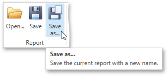
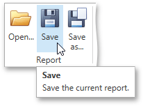
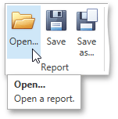

# Back Up the Report Layout
To guarantee that you will be able to revert your report to its original state, you can to create a _backup copy_. Then, you can apply changes without worrying that it will be hard to restore your report, in case something breaks.
* To save a copy of your report, click the **Save As** button in the [Toolbar](../../interface-elements/toolbar.md).
	
	
	
	Then, in the invoked standard **Save** dialog, specify the folder and file name.
* To save the current layout of your report, click the **Save** button in the [Toolbar](../../interface-elements/toolbar.md), or press CTRL+S. When you click this button for the report for the first time, it invokes the **Save** dialog, which allows you to specify where the report should be saved. The subsequent clicking of this button for the same report will silently save the report to the previously specified file.
	
	
* To load a previously saved report, click the **Open** button in the [Toolbar](../../interface-elements/toolbar.md) or press CTRL+O. This invokes the standard **Open** dialog, which allows you to locate and open report files.
	
	