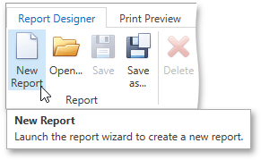
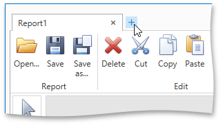

# Create a New Report
This topic explains how to create a new report in the Report Designer.

To create a new report, do one of the following depending on the Report Designer's View.
* In the Classic View, click the **New** button in the [Toolbar](../../interface-elements/toolbar.md).
	
	
* In the Browser View, click the plus button located inside the tab panel next to report headers.
	
	

As a result, the [Report Wizard](../../report-wizard.md) is automatically invoked allowing you to create the required report based on built-in templates.