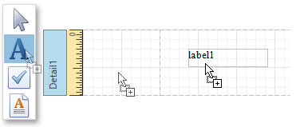
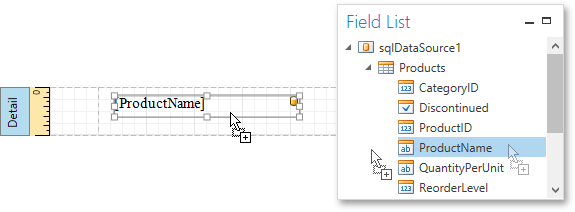
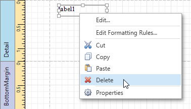

# Create and Delete Report Elements
This document describes how to add and delete [report controls](../../report-elements/report-controls.md) and [bands](../../report-elements/report-bands.md) in the Report Designer.

The topic consists of the following sections.
* [Creating Report Controls](#createcontrols)
* [Creating Report Bands](#createbands)
* [Deleting Controls and Bands](#delete)

<a name="createcontrols"/>

## Creating Report Controls
All available controls are listed in the [Control Toolbox](../../interface-elements/control-toolbox.md). To add a control to the currently opened report, you can drag and drop it onto an appropriate [report band](../../report-elements/report-bands.md).

Report controls of appropriate types are created automatically, after you drag items from the [Field List](../../interface-elements/field-list.md) and drop them onto the [report surface](../../interface-elements/design-surface.md).

<a name="createbands"/>

## Creating Report Bands
To add a new band of a particular type, use the context menu of the report or bands. Right-click a report on the [design surface](../../interface-elements/design-surface.md) or in the [Report Explorer](../../interface-elements/report-explorer.md), and select a band to be inserted in the report.

<a name="delete"/>

## Deleting Controls and Bands
To delete a report control or band, select it on the [design surface](../../interface-elements/design-surface.md) or [Report Explorer](../../interface-elements/report-explorer.md), and then do one of the following.
* Press the DELETE key.
* Right-click the report element, and in the invoked context menu, select **Delete**.
	
	
* Click the **Delete**  button on the [Toolbar](../../interface-elements/toolbar.md).

Note that certain elements cannot be deleted (such as the Detail band).