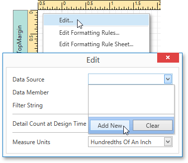
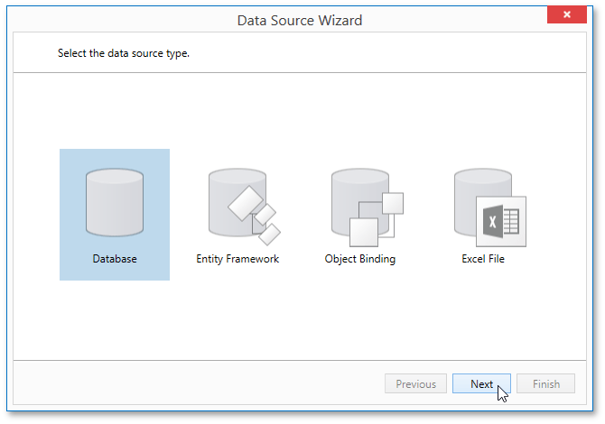
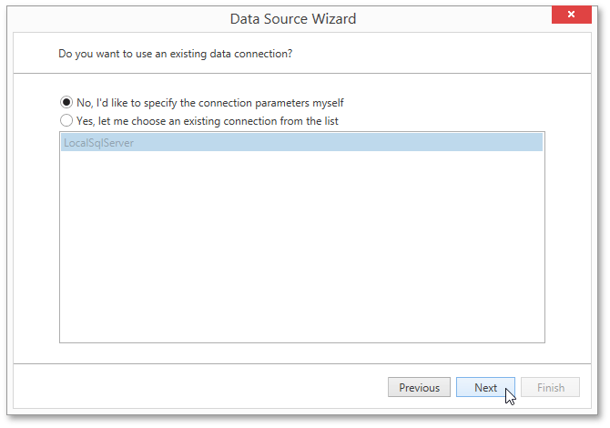
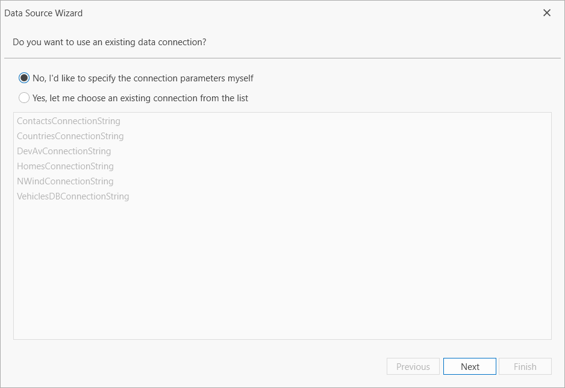
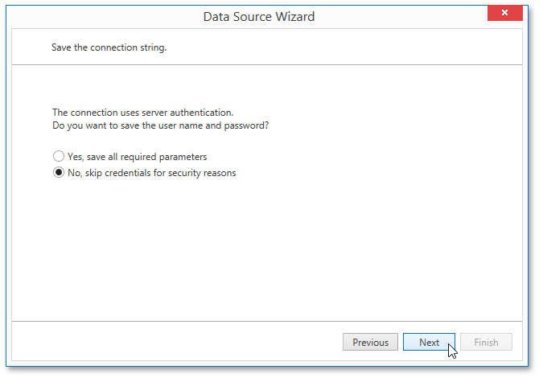
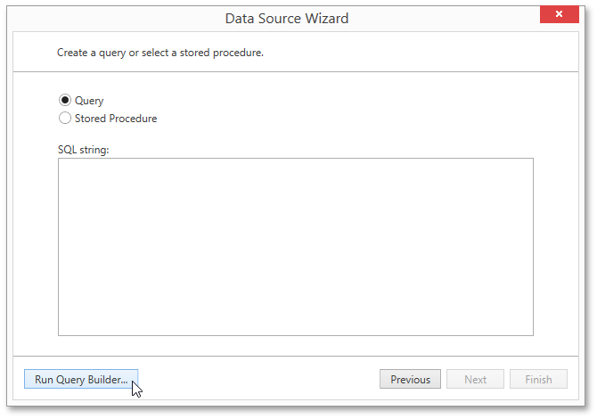
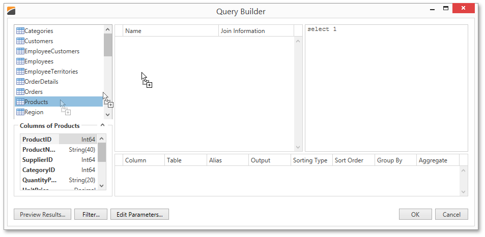
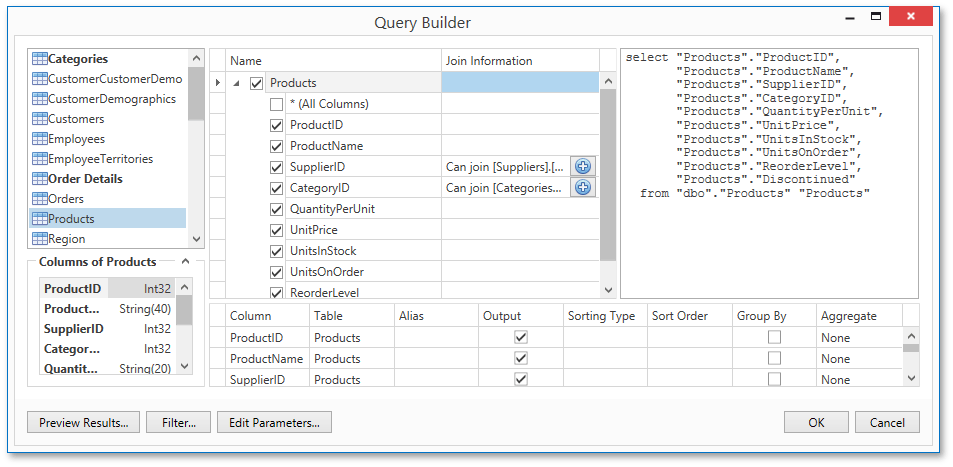
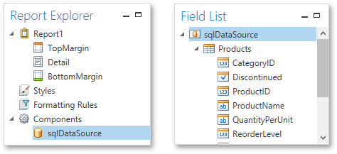

# Bind a Report to a Database
This document describes the steps required to connect a report to a database.

To bind a report to a database, do the following.
1. [Create a new report](../../basic-operations/create-a-new-report.md).
2. Right-click the report and select **Edit...** in the context menu. In the invoked dialog, expand the **Data Source** drop-down and click the **Add New** button.
	
	
3. The first page of the invoked **Data Source Wizard** allows you to specify the data source type. Select **Database** and click **Next** to proceed.
	
	
4. On the next page, specify the data connection to be used. If it is absent in the list containing existing connections, select **No, I'd like to specify the connection parameters myself** and click **Next**.
	
	
5. On the next wizard page, define a custom connection string, or select from the supported data source types. Depending on the data provider selected, it may be necessary to specify additional connection options (such as authentication type and database name) on this page.
	
	
	
	Click **Next** to proceed.
6. If server authentication is required for the selected database type, the next page will prompt you to specify whether or not you want to save the user credentials along with the connection string.
	
	Select the required option and click **Next**.
	
	
7. On the next page, you can construct an SQL query to obtain data from the database, or select a stored procedure.
	
	To construct an SQL query, click **Run Query Builder...**
	
	
8. In the invoked [Query Builder](../../../interface-elements/query-builder.md) window, select an item from the list of available tables on the left and drop it onto the list of data tables to be used.
	
	
9. Enable the check box near the added table to include all of its fields in the data view.
	
	
	
	Click **OK** to exit the **Query Builder**. Click **Finish** to exit the **Data Source Wizard**.
	
	The newly created SQL data source will be displayed in the **Components** node of the [Report Explorer](../../../interface-elements/report-explorer.md). Additionally, the hierarchy of the data source will be reflected by the [Field List](../../../interface-elements/field-list.md).
	
	