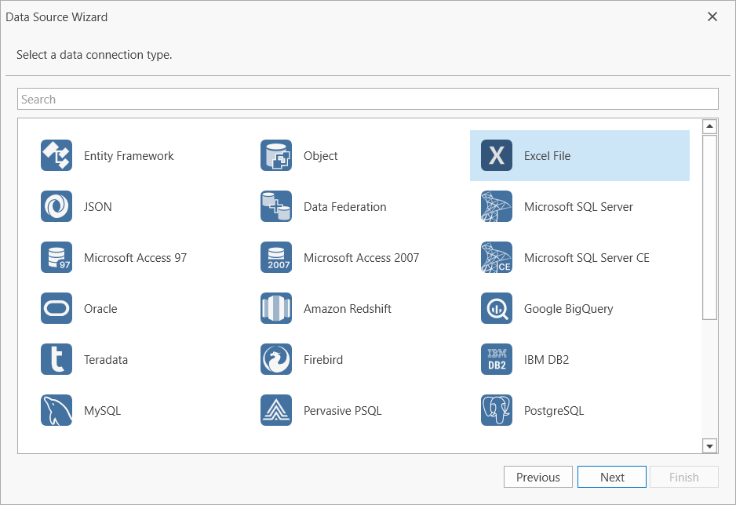
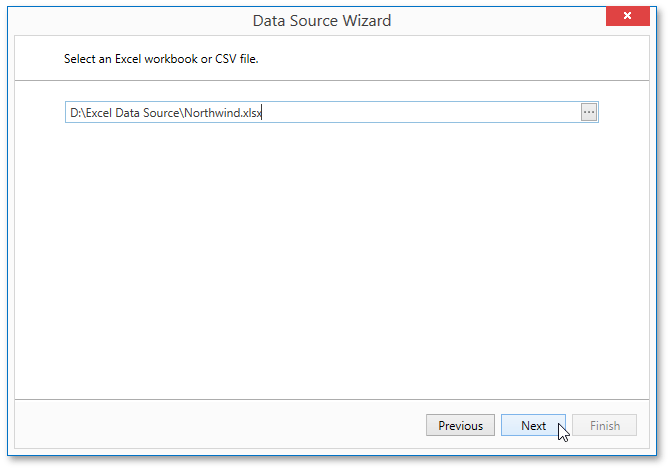
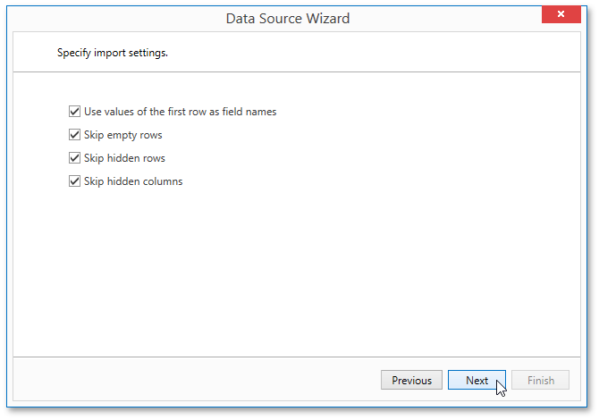
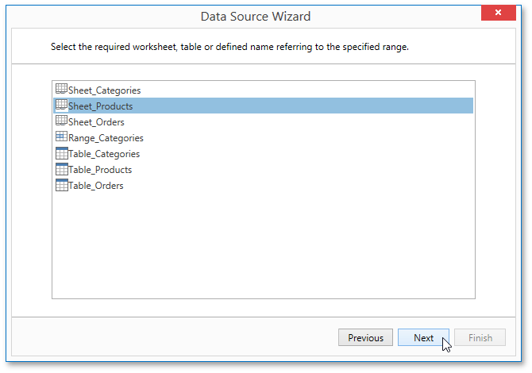
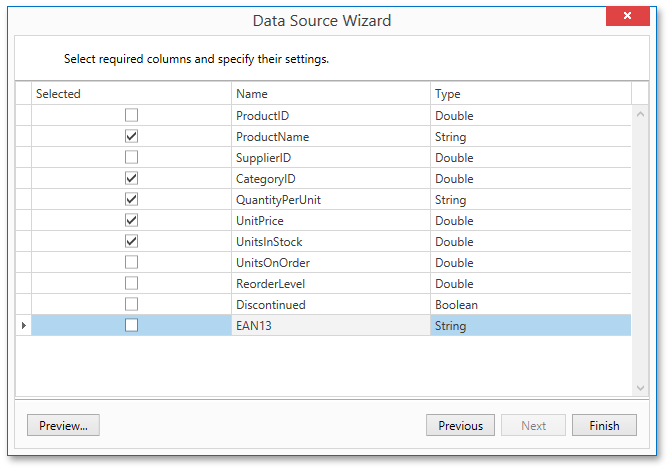
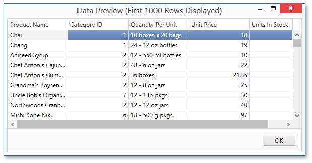
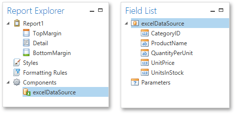

# Bind a Report to an Excel Data Source
This document describes the steps required to connect a report to data obtained from a Microsoft Excel workbook.

To bind a report to an Excel data source, do the following.
1. [Create a new report](../../basic-operations/create-a-new-report.md).
2. Right-click the report and select **Edit...** in the context menu. In the invoked dialog, expand the **Data Source** drop-down and click the **Add New** button.
	
	
3. The first page of the invoked **Data Source Wizard** allows you to specify the data source type. Select **Excel File** and click **Next** to proceed.
	
	
4. On the next wizard page, select a required Excel workbook. To do this, click the ellipsis button and locate the source file or enter the full path to this file. The XLS, XLSX and XLSM formats are supported.
	
	
	
	Click **Next** to proceed to the next wizard page.
5. The next wizard page allows you to specify import settings.
	
	Enable the first check box to use values of the first row as field names. If you disable this option, values of the first row will be imported as data and field names will be generated automatically. You can also specify whether to include empty rows to the result data source, and whether to skip hidden rows and columns.
	
	
	
	Specify required settings and click **Next**.
6. On the next wizard page specify from which part of the workbook to extract data. All worksheets, tables and named regions existing in the workbook are listed here.
	
	
7. The next wizard page allows you to select required columns and specify their settings.
	
	To select a column, enable the corresponding **Selected** check box. Use **Name** to specify the custom column name and **Type** to choose the column type.
	
	
	
	On this page, you can also preview the resulting data by clicking the **Preview...** button.
	
	

Click **Finish** to complete the wizard.

The newly created data source will be displayed in the **Components** node of the [Report Explorer](../../../interface-elements/report-explorer.md). Additionally, the hierarchy of the data source will be reflected by the [Field List](../../../interface-elements/field-list.md).

