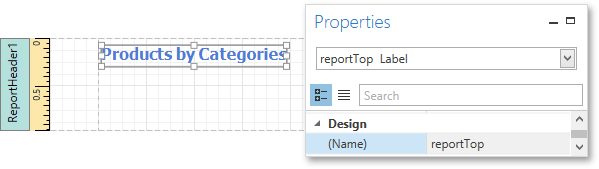
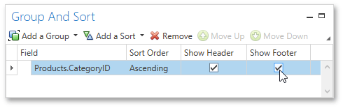
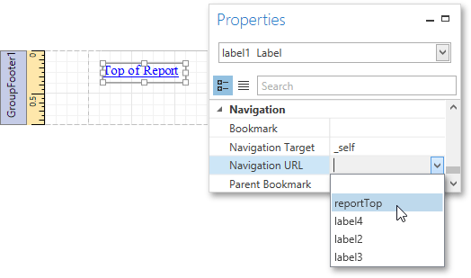
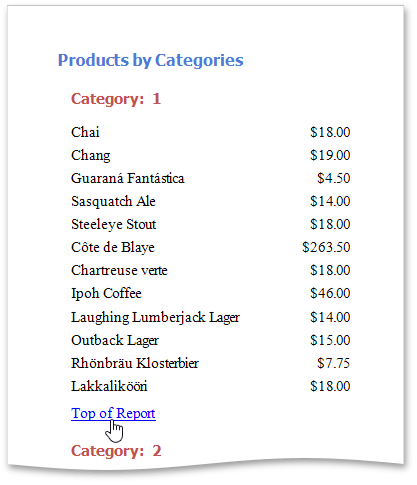

# Add a Cross-Reference
This tutorial demonstrates how to add a _cross-reference_ to your report. A cross-reference is a link whose target is located within the current document and which allows you to establish easy navigation through a report. In this example, a link is placed at the bottom of each group, leading to the beginning of the report.

To demonstrate this feature, use a report with grouping similar to the one created in the following tutorial: [Grouping Data](../shaping-data/grouping-data.md).

To create a report with cross-references, do the following.
1. Drop a label onto the created [Report Header](../../report-elements/report-bands.md) band, which will serve as the report's headline. Click the label to type the desired contents into it. Then, in the [Properties Panel](../../interface-elements/properties-panel.md), set its **Name** property to **reportTop**.
	
	
2. To accompany the existing Group Header with the corresponding Footer, in the [Group and Sort Panel](../../interface-elements/group-and-sort-panel.md), enable the **Show Footer** option.
	
	
3. Then, drop a label onto the Group Footer band. Change the label's **Text** to **Top of Report** and apply the desired formatting to it (e.g., the blue color and underlined text).
	
	Set its **Navigation Target** property to **_self**. Then, if you click the drop-down list of the **Navigation URL** property, you can see the controls available in your report. Choose the one named **reportTop**.
	
	

The report with cross-references is now ready. Switch to the [Print Preview](../../document-preview.md) tab and view the result.

