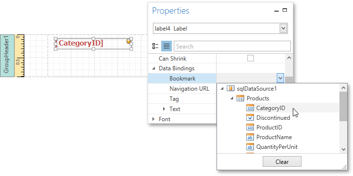
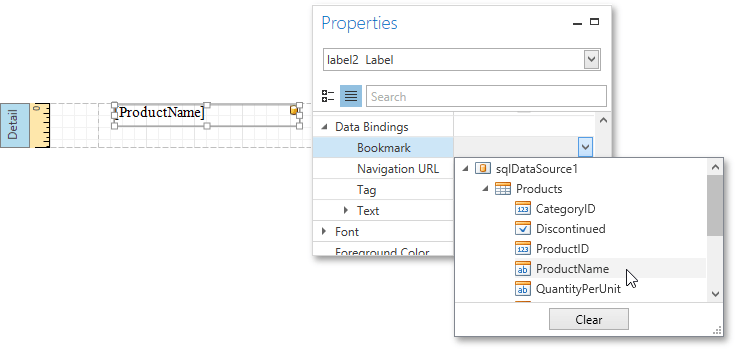
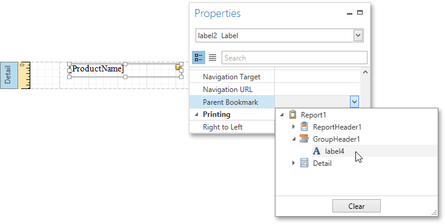
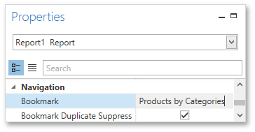
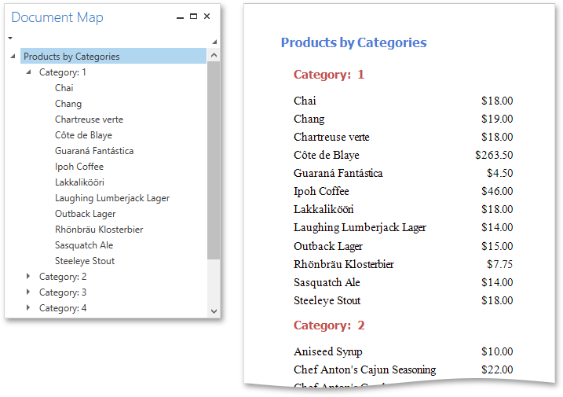

# Add Bookmarks
This tutorial describes the steps to create a report with _bookmarks_ (a so-called _Document Map_). This feature allows you to easily navigate through the report during [print preview](../../document-preview.md).

To demonstrate the Document Map feature, use a report with grouping, similar to the one created in the following tutorial: [Grouping Data](../shaping-data/grouping-data.md).

To create a report with bookmarks, do the following.
1. Select the label placed in the [Group Header band](../../report-elements/report-bands.md), and in the [Properties Panel](../../interface-elements/properties-panel.md), expand the **Data Bindings** property. As this control is bound to data, bind its **Bookmark** property to the same data field (in this example, **CategoryID**).
	
	
	
	Note that as with other bindable properties, you can also apply [value formatting](../shaping-data/formatting-data.md) to the **Bookmark** property (e.g., **Category: {0}**).
2. In the same way, select the label in the Detail band and set its **Bookmark** property to the **ProductName** data field.
	
	
3. Then, for the same label, set the **Parent Bookmark** property to the Group Header's label to define the Document Map's hierarchy.
	
	
4. Finally, select the report itself and assign text to its **Bookmark** property, which determines the caption of the root node of the Document Map.
	
	

The report with bookmarks is now ready. Switch to the [Print Preview](../../document-preview.md) tab and use the [Document Map Panel](../../document-preview/document-map-panel.md) to navigate through the report.

