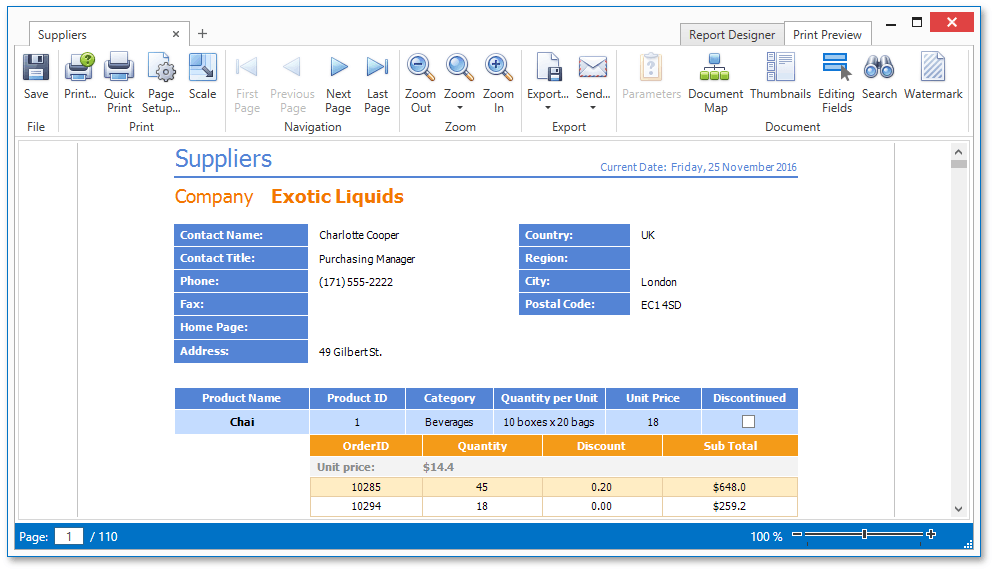

# Document Preview
To display a preview for the report currently being opened in the Report Designer, switch to the **Print Preview** tab. You will see the report populated with data and divided into pages.

The document preview allows you to check the print output of a report and customize its additional options using the [Preview Toolbar](document-preview/preview-toolbar.md). The report can be then exported to different third-party formats, sent using e-mail or printed.

Different elements of the Report Designer's preview are covered in the following documents.
* [Preview Toolbar](document-preview/preview-toolbar.md)
* [Export Document Dialog](document-preview/export-document-dialog.md)
* [Parameters Panel](document-preview/parameters-panel.md)
* [Search Panel](document-preview/search-panel.md)
* [Document Map Panel](document-preview/document-map-panel.md)

> [!NOTE]
> To learn more about the options available in the preview mode, refer to the [Print Preview for WPF](../../print-preview/print-preview-for-wpf.md) section of this documentation.