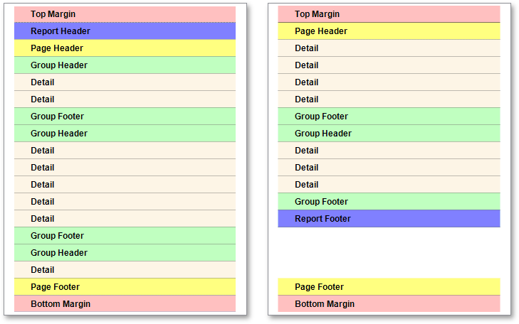
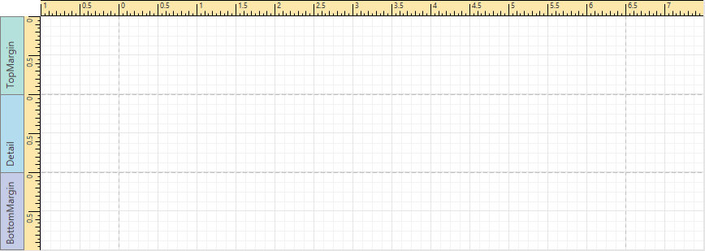
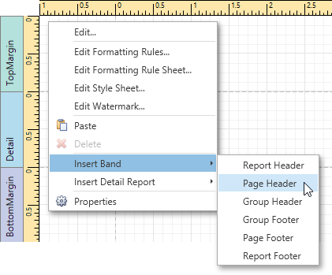

# Report Bands
A _Report Band_ is a specific area on a report page, used to define how to render report controls that belong to it, their rendering order and how many times they are rendered. In the Report Designer, every report consists of a number of bands, each of a different type.

This document consists of the following sections.
* [Available Bands](#available)
* [Band Positions](#positions)
* [Editing Bands](#editing)

<a name="available"/>

## Available Bands
The following table lists all available band types.

| Band | Description |
|---|---|
| **Top Margin Band** | Located on the top margin of every page, above the **Page Header** and **Report Header**. This band is intended for displaying [page numbers](../creating-reports/adding-details-about-a-report/add-page-numbers-and-system-information-to-a-report.md) or certain supplementary information (e.g., current system time or the user name). |
| **Report Header Band** | Located at the beginning of a report. This band is intended to display some introductory information, e.g., the report's name, company logo, [date of creation and user name](../creating-reports/adding-details-about-a-report/add-page-numbers-and-system-information-to-a-report.md), etc. |
| **Page Header Band** | Located at the top of every page, below the **Top Margin** and **Report Header**. This band is the best place for information that should be printed on every page. For example, use it to display the header of a [table](../report-types/table-report.md) which is continued from the previous page. |
| **Group Header Band** | Located at the beginning of every group or at the top of the page in case it is split across pages. This band specifies grouping criteria and is used to display information at the beginning of a group of records. To learn more, refer to [Grouping Data](../creating-reports/shaping-data/grouping-data.md). |
| **Detail Band** | Located in the central part of a report between all other bands. This band cannot be deleted since the present report structure includes the **Detail** band in its core. This band displays a single record at a time from the bound data source, or simply holds unbound controls if there is no data source assigned to a report. For more information on data binding, refer to [Providing Data](../creating-reports/providing-data.md). |
| **Detail Report Band** | Located below the **Detail** band and used to incorporate one report into another in master-detail reports. It is quite different from the **Detail** band, since it holds the whole detail report in a master-detail report layout, and therefore can contain other types of bands within it. To learn more about detail reports, refer to [Master-Detail Report (Detail Report Bands)](../report-types/master-detail-report-(detail-report-bands).md). |
| **Group Footer Band** | Located at the end of every group or at the bottom of the page if its group is split across pages. This band is primarily intended to show summary information for a group. To learn more, refer to [Grouping Data](../creating-reports/shaping-data/grouping-data.md). |
| **Report Footer Band** | Located at the end of the report, before the **Page Footer** and **Bottom Margin** on the report's last page. This band is intended to display some final information, e.g., report [totals](../creating-reports/shaping-data/calculating-summaries.md). |
| **Page Footer Band** | Located at the bottom of every page, below the **Report Footer** and above the **Bottom Margin**. This band is intended to display page numbers or a table footer, which is continued on the following page. |
| **Bottom Margin Band** | Located on the bottom margin of every page, below the **Page Footer**. This band is intended for displaying [page numbers](../creating-reports/adding-details-about-a-report/add-page-numbers-and-system-information-to-a-report.md) or certain supplementary information (e.g., current system time or the user name). |
| **Sub-Band** | This band provides a functional copy of the source band below which it is located. A sub-band's behavior, as well as its position within the report band hierarchy, is dictated by the source band type. Any number of sub-bands can be added to the report band of any type except for the **Top Margin** and **Bottom Margin** bands and the sub-band itself. Using sub-bands, it is possible to create multiple versions of a band within a single report and choose an appropriate version later based on a [specific condition](../creating-reports/appearance-customization/conditionally-hide-bands.md). |

<a name="positions"/>

## Band Positions
The following image illustrates the relative positions of different band types, and how many times they are rendered in a report.

The **Page Header**, **Page Footer**, **Top Margin** and **Bottom Margin** bands are rendered in the report preview on every page.

The **Report Header** and **Report Footer** bands are rendered in the report preview only once.

The **Group Header** and **Group Footer** bands are rendered for every group of records in a report.

The number of times the **Detail** band is rendered in a report depends upon the number of records returned from the bound data source - one band per record.

<a name="editing"/>

## Editing Bands
The following image shows the default report layout. It is divided into three basic bands (**Top Margin**, **Detail** and **Bottom Margin** bands) that provide space for placing different [report controls](report-controls.md) on them.

To add a new band of a particular type, use the context menu of the report or bands. Right-click a report on the [design surface](../interface-elements/design-surface.md) or in the [Report Explorer](../interface-elements/report-explorer.md), and select a band to be inserted in the report.

For more information on adding and removing bands in the Report Designer, refer to the [Create and Delete Report Elements](../creating-reports/basic-operations/create-and-delete-report-elements.md) document. To learn how to change the band layout, see [Adjust the Layout of Report Elements](../creating-reports/basic-operations/adjust-the-layout-of-report-elements.md).